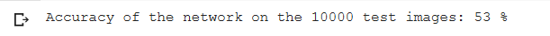

##  

 _Switch to dark mode for better readability_ 

The goal of this project was to build an Image Classifier for the Cifar-10 dataset. When given a dataset of images the project should put the images in their proper class.

The CIFAR-10 data consists of 60,000 (32×32) color images in 10 classes, with 6000 images per class. There are 50,000 training images and 10,000 test images in the official data. It has the classes: ‘airplane’, ‘automobile’, ‘bird’, ‘cat’, ‘deer’, ‘dog’, ‘frog’, ‘horse’, ‘ship’, ‘truck’.

To begin with I started with [PyTorch's Tutorial](https://pytorch.org/tutorials/beginner/blitz/cifar10_tutorial.html#sphx-glr-beginner-blitz-cifar10-tutorial-py) and then proceeded to make multiple changes to the model in an attempt to increase the test accuracy. I tried different things and came up with 4 different approaches(in addition to the existing default code) to tackle this problem.

[Here](https://github.com/saahilanande/cifar10/blob/main/datamining_assignment_1.ipynb) is a link to the jupyter notebook with the best results.

Initial results when started with Pytorch's Tutorial: Test Accuracy 55% ; loss 1.086


Improved results after changes to Pytorch's Tutorial: Test Accuracy 71% ; loss 0.6942


STEP 1: Import libraries

```python
import torch
import torchvision
import torchvision.transforms as transforms
```
STEP 2: Load Training Data

Convert Python Image Library (PIL) format to PyTorch tensors

Normalize the data by specifying a mean and standard deviation for each of the three channels.This will convert the data from [0,1] to [-1,1]

Normalization helps speed up further conversions

```python
transform = transforms.Compose(
    [transforms.ToTensor(),
     transforms.Normalize((0.5, 0.5, 0.5), (0.5, 0.5, 0.5))])

batch_size = 4

trainset = torchvision.datasets.CIFAR10(root='./data', train=True,
                                        download=True, transform=transform)
trainloader = torch.utils.data.DataLoader(trainset, batch_size=batch_size,
                                          shuffle=True, num_workers=2)

testset = torchvision.datasets.CIFAR10(root='./data', train=False,
                                       download=True, transform=transform)
testloader = torch.utils.data.DataLoader(testset, batch_size=batch_size,
                                         shuffle=False, num_workers=2)

classes = ('plane', 'car', 'bird', 'cat',
           'deer', 'dog', 'frog', 'horse', 'ship', 'truck')
```

STEP 3: Show some of the training images

```python
import matplotlib.pyplot as plt
import numpy as np

# functions to show an image


def imshow(img):
    img = img / 2 + 0.5     # unnormalize
    npimg = img.numpy()
    plt.imshow(np.transpose(npimg, (1, 2, 0)))
    print(npimg.shape)
    plt.show()


# get some random training images
dataiter = iter(trainloader)
images, labels = dataiter.next()

# show images
imshow(torchvision.utils.make_grid(images))
# print labels
print(' '.join('%5s' % classes[labels[j]] for j in range(batch_size)))
```

STEP 4: Define a Convolutional Neural Network.


Let's Improve Accuracy of our model


#### Here is a graph comparing the Test accuracy for modles 0 - 4 :


#### Here is a plot showing the trend in loss for each model :


#### This bar graph shows the accuracy of prediction for each class of image seperately :


### Model 0:

#### Test Accuracy : 55% ; Training Accuracy : not calculated ; Loss : 1.086

The first model was the default model provided by PyTorch. This model set the base for this project. My goal was to experiment with Network topology and other hyperparameters to improve the performance (increase test accuracy).
This model consisted of 2 Convolutional layers, 3 fully connected layers, a max pool layer which was applied to each of the convolutional layers. Before applying the max pool layer a Relu activation function was applied to the convolutional layers.


The **Convolutional layer** This layer is the first layer that is used to extract the various features from the input images. In this layer, the mathematical operation of convolution is performed between the input image and a filter of a particular size MxM. By sliding the filter over the input image, the dot product is taken between the filter and the parts of the input image with respect to the size of the filter (MxM).

The output is termed as the Feature map which gives us information about the image such as the corners and edges. Later, this feature map is fed to other layers to learn several other features of the input image.[_Source_](https://www.upgrad.com/blog/basic-cnn-architecture/)

A **fully connected layer** The Fully Connected (FC) layer consists of the weights and biases along with the neurons and is used to connect the neurons between two different layers. These layers are usually placed before the output layer and form the last few layers of a CNN Architecture.

In this, the input image from the previous layers are flattened and fed to the FC layer. The flattened vector then undergoes few more FC layers where the mathematical functions operations usually take place. In this stage, the classification process begins to take place. [_Source_](https://www.upgrad.com/blog/basic-cnn-architecture/)

**Maxpool2D** In Max Pooling, the largest element is taken from feature map. Average Pooling calculates the average of the elements in a predefined sized Image section. The total sum of the elements in the predefined section is computed in Sum Pooling. The Pooling Layer usually serves as a bridge between the Convolutional Layer and the FC Layer [_Source_](https://www.upgrad.com/blog/basic-cnn-architecture/)

**ReLU** stands for rectified linear activation unit, it returns 0 if it receives any negative input, but for any positive value x, it returns that value back. Thus it gives an output that has a range from 0 to infinity. [_Source_](https://www.mygreatlearning.com/blog/relu-activation-function/)


### Model 1:

#### Test Accuracy : 44% ; Loss : 1.312

To start with I tried to Make changes to the fully connected layer as its the easiest to manage. First i tried to change the values of the existing FC layers then decided to add one extra Fc layer to see if it has any improvement on the previous model, But the Accuracy decreased by 1%. 


To Further test the fully connected layer I added 2 more layers to the previous model which in total resulted in 6 FC layers. I tried different sets of values but the best accuracy this model could produced was way less than the previous model.


### Model 2:

#### Test Accuracy : 59% ; Loss : 1.134
In my next attempt I tried to make the model more complex by adding a Convolutional layer. This increase the Accuracy to 54% but it was still less than the base model. Since it was showing improvement, I Increase the value of the layers and change the kernel size to 3.




**Model After modification**


And finally The accuracy I got was the best till now. 59% Accuracy with decreased loss.


### Model 3:

#### Test Accuracy : 64% ; Loss : 1.023

After adding one convolution layer the accuracy increase but it was mainly due to the scaling values and the kernel size, so in this attempt i decided to drop the added convolution layer and decided to change the scaling and kernel.


Fortunately the accuracy increase tremendously to 64% with decrease loss.

### Model 4:
#### Test Accuracy : 71% ; Loss : 0.6942
For the 4th attempt i decided to train the model for more epochs because training it for just 2 epochs was too less and the loss kept on decreasing as well.

I increase to 5 epochs and the Accuracy increase to 71% with loss 0.6942


I further tried to increase the epochs to 15 but noticed that the loss was not futher decreasing after 5 epochs.


### Challenges faced:
Adding another convolutional layer for me was the biggest challenge. on my first attempt of adding another convolutional layer I simply changed the input and output parameters not realising that the required dimensions after flattening would also need to be changed. After facing errors after multiple trials i stumbled upon [Python Engineer's Tutorial on YouTube](https://www.youtube.com/watch?v=pDdP0TFzsoQ&t=882s&ab_channel=PythonEngineer) which perfectly explained how the dimesions of the image changes after applying each convolutional and MaxPool layer.


### My Observations:
On observing the bar chart below, you will notice that the model, even on it's best performance struggled to classify birds, cats, dogs, and deers. One reason for this that I could come up with was that cats, dogs, and deers being 4-legged animals might have been difficult to distinguish. In my opinion to tackle this problem the model should have been made a little more complex.


A trend that I observed was that the performance of the model increased when the number of nodes in the model were increased.

In the end this project was fun to do and was a great learning experience.


### References:

[1] https://pytorch.org/tutorials/beginner/blitz/cifar10_tutorial.html#sphx-glr-beginner-blitz-cifar10-tutorial-py

[2] https://www.upgrad.com/blog/basic-cnn-architecture/

[3] https://keras.io/api/layers/convolution_layers/convolution2d/

[4] https://www.mathworks.com/help/deeplearning/ref/nnet.cnn.layer.fullyconnectedlayer.html#:~:text=A%20fully%20connected%20layer%20multiplies%20the%20input%20by,to%20all%20the%20neurons%20in%20the%20previous%20layer

[5] https://www.tensorflow.org/api_docs/python/tf/keras/layers/MaxPool2D

[6] https://www.mygreatlearning.com/blog/relu-activation-function/

[7] https://discuss.pytorch.org/t/calculate-train-accuracy-of-the-model-in-segmentation-task/33581

[8] https://www.youtube.com/watch?v=pDdP0TFzsoQ&t=882s&ab_channel=PythonEngineer


