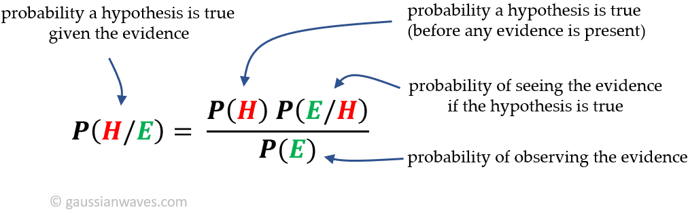

##  

 _Switch to dark mode for better readability_ 

**Some outputs are shortened on the blog for easier reading. For Complete Jupyter Notebook click below.**

[_Link to Jupyter Notebook_](https://github.com/saahilanande/naivebayes/blob/main/Assignment_3_DM.ipynb)


### What is Bayes Theorem?

Bayes’ theorem is a way to figure out conditional probability. Conditional probability is the probability of an event happening, given that it has some relationship to one or more other events. For example, your probability of getting a parking space is connected to the time of day you park, where you park, and what conventions are going on at any time. Bayes’ theorem is slightly more nuanced. In a nutshell, it gives you the actual probability of an event given information about tests.  [_Source_](https://www.statisticshowto.com/probability-and-statistics/probability-main-index/bayes-theorem-problems/)

Below is the formula for conditional probability using Bayes Theorem:

[_Source_](https://www.gaussianwaves.com/gaussianwaves/wp-content/uploads/2021/04/bayes-theorem.png)

### What is the relevance of each word in 'Naive Bayes Classifier'?

It is a classification technique based on Bayes’ Theorem with an assumption of independence among predictors. In simple terms, a Naive Bayes classifier assumes that the presence of a particular feature in a class is unrelated to the presence of any other feature.

For example, a fruit may be considered to be an apple if it is red, round, and about 3 inches in diameter. Even if these features depend on each other or upon the existence of the other features, all of these properties independently contribute to the probability that this fruit is an apple and that is why it is known as ‘Naive’.[_Source_](https://www.analyticsvidhya.com/blog/2017/09/naive-bayes-explained/)

**Naive:** The word 'Naive' indicates that the algorithm assumes independence among attributes Xi when class is given: 

P(X1, X2, ..., Xd|Yj) = P(X1| Yj) P(X2| Yj)... P(Xd| Yj)

**Bayes:** This signifies the use of Bayes theorem to calculate conditional probablity

**Classifier:** Shows that the application of the algorithm is to classify a given set of inputs

### What is Laplace Smoothing?

If one of the conditional probabilities is zero, then the entire expression becomes zero. To solve this error we use Lapace Smoothing. To perform Laplace smoothing we add 1 to the numerator and 'v' to the denomenator of all probabilites. where 'v' is the total number of attribute values that Xi can take


### Accuracy on test dataset before smoothening: 14%

### Final accuracy on test dataset after performing laplacian smoothening: 81%

### References at the end of the page

# IMPORT REVIEW DATA


# SPLITING THE DATA INTO TRAIN TEST VALIDATION


# Build a vocabulary as list.

```python
review_list=[]
word_list=[]
word_list2 = []
word_list3 = []
positive_count=[]
negative_count = []
total_count= []
a=[]
from collections import Counter

review_list=train_review.values.tolist()


for i in range(len(train_review)):
  if review_list[i][1] == 1:
    for words in review_list[i][0].lower().split():
      words = words.replace(".","").replace("?","").replace("!","").replace(",","").replace("(","").replace(")","")
      word_list.append(words)
      positive_count = list(Counter(word_list).items())
      positive_count.sort(key=lambda x:x[1], reverse=True)


  if review_list[i][1] == 0:
    for wordsx in review_list[i][0].lower().split():
      wordsx = wordsx.replace(".","").replace("?","").replace("!","").replace(",","").replace("(","").replace(")","")
      word_list2.append(wordsx)
      negative_count = list(Counter(word_list2).items())
      negative_count.sort(key=lambda x:x[1], reverse=True)

  for wordss in review_list[i][0].lower().split():
    wordss = wordss.replace(".","").replace("?","").replace("!","").replace(",","").replace("(","").replace(")","")
    word_list3.append(wordss)
    total_count = list(Counter(word_list3).items())
    total_count.sort(key=lambda x:x[1], reverse=True)
```


# omit rare words


# Probability of the occurrence

P[“the”] = num of documents containing ‘the’ / num of all documents


# Conditional probability based on the sentiment

P[“the” | Positive] = # of positive documents containing “the” / num of all positive review documents


P[“the” | Negative] = # of positive documents containing “the” / num of all positive review documents


# Total positive probability and negative probability


# Sentiment ANALYSIS

```python
def sentiment(line):
  # for word in line[i][0].lower().split():
  pred = []
  mul_pos_prop = float(totalposprob)
  mul_neg_prop = float(totalnegprob)
  for word in line.lower().split():
    word = word.replace(".","").replace("?","").replace("!","").replace(",","").replace("(","").replace(")","")
    # if word not in [i[0] for i in omited_positive_count]:
    if word not in [i[0] for i in postive_prop]:
      # print("NOT IN POS",word)
      # print(word,"0","1")
      ll = [word,"0","1"]
      pred.append(ll)
    else:
      for props in postive_prop:
        if word == props[0]:
          # print(props[0],props[1],"1")
          ll = [props[0],props[1],"1"]
          pred.append(ll)

    # if word not in [i[0] for i in omited_negative_count]:
    if word not in [i[0] for i in negative_prop]:
      # print("NOT IN NEG",word)
      # print(word,"0","0")
      ll = [word,"0","0"]
      pred.append(ll)
    else:
      for prop in negative_prop:
        if word == prop[0]:
          # print(prop[0],prop[1],"0")
          ll = [prop[0],prop[1],"0"]
          pred.append(ll)
    
  for r in pred:
    if r[2] == '1':
      mul_pos_prop = mul_pos_prop*float(r[1])

    if r[2] == '0':
      mul_neg_prop = mul_neg_prop*float(r[1])

  if mul_neg_prop>mul_pos_prop:
    return 0
    # print(mul_neg_prop,"n")
    
  if mul_neg_prop<mul_pos_prop:
    return 1
    # print(mul_pos_prop,"p")
```

# Calculate accuracy using dev dataset


# SMOOTHING


```python
def Smoothing(line):
  pred = []
  mul_pos_prop = float(totalposprob)
  mul_neg_prop = float(totalnegprob)
  for word in line.lower().split():
    if word not in [i[0] for i in smooth_postive_prop]:
      ll = [word,1/(len(smooth_postive_prop)+2),"1"]
      pred.append(ll)
    else:
      for props in smooth_postive_prop:
        if word == props[0]:
          # print(props[0],props[1],"1")
          ll = [props[0],props[1],"1"]
          pred.append(ll)

    if word not in [i[0] for i in smooth_negative_prop]:
      # print("NOT IN NEG",word)
      # print(word,"0","0")
      ll = [word,1/(len(smooth_negative_prop)+2),"0"]
      pred.append(ll)
    else:
      for prop in smooth_negative_prop:
        if word == prop[0]:
          # print(prop[0],prop[1],"0")
          ll = [prop[0],prop[1],"0"]
          pred.append(ll)
    
  for r in pred:
    if r[2] == '1':
      mul_pos_prop = mul_pos_prop*float(r[1])

    else:
      mul_neg_prop = mul_neg_prop*float(r[1])

  if mul_neg_prop>mul_pos_prop:
    return 0
    # print(mul_neg_prop,"n")
    
  if mul_neg_prop<mul_pos_prop:
    return 1
    # print(mul_pos_prop,"p")
```

# Calculate accuracy after smoothing


# perform 5 fold cross validation

```python
s1=[]
s2=[]
s3=[]
s4=[]
s5=[]
train_set=[]

s1 = train_review.iloc[:160].values.tolist()
s2 = train_review.iloc[160:320].values.tolist()
s3 = train_review.iloc[320:480].values.tolist()
s4 = train_review.iloc[480:640].values.tolist()
s5 = train_review.iloc[640:800].values.tolist()

firsttrain=[]
firstvalid=[]
for item in s1:
  firsttrain.append(item)
for item in s2:
  firsttrain.append(item)
for item in s3:
  firsttrain.append(item)
for item in s4:
  firsttrain.append(item)
for item in s5:
  firstvalid.append(item)


secoundtrain=[]
secoundvalid=[]
for item in s2:
  secoundtrain.append(item)
for item in s3:
  secoundtrain.append(item)
for item in s4:
  secoundtrain.append(item)
for item in s5:
  secoundtrain.append(item)
for item in s1:
  secoundvalid.append(item)

thirdtrain=[]
thirdvalid=[]
for item in s3:
  thirdtrain.append(item)
for item in s4:
  thirdtrain.append(item)
for item in s5:
  thirdtrain.append(item)
for item in s1:
  thirdtrain.append(item)
for item in s2:
  thirdvalid.append(item)


fourthtrain=[]
fourthvalid=[]
for item in s4:
  fourthtrain.append(item)
for item in s5:
  fourthtrain.append(item)
for item in s1:
  fourthtrain.append(item)
for item in s2:
  fourthtrain.append(item)
for item in s3:
  fourthvalid.append(item)

fifthtrain=[]
fifthvalid=[]
for item in s5:
  fifthtrain.append(item)
for item in s1:
  fifthtrain.append(item)
for item in s2:
  fifthtrain.append(item)
for item in s3:
  fifthtrain.append(item)
for item in s4:
  fifthvalid.append(item)


def fold(train):
  word_list=[]
  word_list2 = []
  word_list3 = []
  pp_count=[]
  nn_count = []
  tt_count= []

  for i in range(len(train)):
    if train[i][1] == 1:
      for words in train[i][0].lower().split():
        words = words.replace(".","").replace("?","").replace("!","").replace(",","").replace("(","").replace(")","")
        word_list.append(words)
        pp_count = list(Counter(word_list).items())
        pp_count.sort(key=lambda x:x[1], reverse=True)


    if train[i][1] == 0:
      for wordsx in train[i][0].lower().split():
        wordsx = wordsx.replace(".","").replace("?","").replace("!","").replace(",","").replace("(","").replace(")","")
        word_list2.append(wordsx)
        nn_count = list(Counter(word_list2).items())
        nn_count.sort(key=lambda x:x[1], reverse=True)

    for wordss in train[i][0].lower().split():
      wordss = wordss.replace(".","").replace("?","").replace("!","").replace(",","").replace("(","").replace(")","")
      word_list3.append(wordss)
      tt_count = list(Counter(word_list3).items())
      tt_count.sort(key=lambda x:x[1], reverse=True)

  return pp_count,nn_count,tt_count

pp_count1,nn_count1,tt_count1 = fold(firsttrain)
pp_count2,nn_count2,tt_count2 = fold(secoundtrain)
pp_count3,nn_count3,tt_count3 = fold(thirdtrain)
pp_count4,nn_count4,tt_count4 = fold(fourthtrain)
pp_count5,nn_count5,tt_count5 = fold(fifthtrain)


def prop(train,tc,pc,nc):
  tt_prob=[]
  for i in tc:
    eachprob =i[0],i[1]/len(train)
    tt_prob.append(eachprob)

  ppcount = 0
  npcount = 0
  for i in range(len(train)):
    if review_list[i][1] == 1:
      ppcount = ppcount + 1

    if review_list[i][1] == 0:
      npcount = npcount + 1

  pp_prop=[]
  for j in pc:
    eachposprob =j[0],j[1]/ppcount
    pp_prop.append(eachposprob)

  nn_prop=[]
  for i in nc:
    eachnegprob =i[0],i[1]/npcount
    nn_prop.append(eachnegprob)

  return tt_prob, pp_prop, nn_prop,ppcount,npcount

tt_prob1,pp_prop1,nn_prop1,ppcount1,npcount1 = prop(firsttrain,tt_count1,pp_count1,nn_count1)
tt_prob2,pp_prop2,nn_prop2,ppcount2,npcount2 = prop(secoundtrain,tt_count2,pp_count2,nn_count2)
tt_prob3,pp_prop3,nn_prop3,ppcount3,npcount3 = prop(thirdtrain,tt_count3,pp_count3,nn_count3)
tt_prob4,pp_prop4,nn_prop4,ppcount4,npcount4 = prop(fourthtrain,tt_count4,pp_count4,nn_count4)
tt_prob5,pp_prop5,nn_prop5,ppcount5,npcount5 = prop(fifthtrain,tt_count5,pp_count5,nn_count5)


def foldsentiment(line,pp_prop,nn_prop):
  # for word in line[i][0].lower().split():
  pred = []
  mul_pos_prop = 1
  mul_neg_prop = 1
  for word in line.lower().split():
    word = word.replace(".","").replace("?","").replace("!","").replace(",","").replace("(","").replace(")","")
    # if word not in [i[0] for i in omited_positive_count]:
    if word not in [i[0] for i in pp_prop]:
      # print("NOT IN POS",word)
      # print(word,"0","1")
      ll = [word,"0","1"]
      pred.append(ll)
    else:
      for props in pp_prop:
        if word == props[0]:
          # print(props[0],props[1],"1")
          ll = [props[0],props[1],"1"]
          pred.append(ll)

    # if word not in [i[0] for i in omited_negative_count]:
    if word not in [i[0] for i in nn_prop]:
      # print("NOT IN NEG",word)
      # print(word,"0","0")
      ll = [word,"0","0"]
      pred.append(ll)
    else:
      for prop in nn_prop:
        if word == prop[0]:
          # print(prop[0],prop[1],"0")
          ll = [prop[0],prop[1],"0"]
          pred.append(ll)
    
  for r in pred:
    if r[2] == '1':
      mul_pos_prop = mul_pos_prop*float(r[1])

    if r[2] == '0':
      mul_neg_prop = mul_neg_prop*float(r[1])

  if mul_neg_prop>mul_pos_prop:
    return 0
    # print(mul_neg_prop,"n")
    
  if mul_neg_prop<mul_pos_prop:
    return 1

    def foldaccuracy(dev,pp_prop,nn_prop):

  correct = 0

  for x in dev:
    result = foldsentiment(x[0],pp_prop,nn_prop)
    if result == x[1]:
      correct = correct + 1
  print("Accuracy is ",correct/len(dev)*100)
  gg = correct/len(dev)*100
  return gg


result1 = foldaccuracy(firstvalid,pp_prop1,nn_prop1)
result2 = foldaccuracy(secoundvalid,pp_prop2,nn_prop2)
result3 = foldaccuracy(thirdvalid,pp_prop3,nn_prop3)
result4 = foldaccuracy(fourthvalid,pp_prop4,nn_prop4)
result5 = foldaccuracy(fifthvalid,pp_prop5,nn_prop5)

meanresult= (result1 + result2 + result3 + result4 + result5)/5
print("accuracy of 5 fold cross validation without using smoothing is:",meanresult)
```


# Top 10 words that predicts positive and negative class

P[Positive| word]


P[Negative| word]


### Challenges faced:

Initialy when I attempted to implement the classifier on the IMDB dataset, only 768 out of 1000 lines were being read. I attempted to fix it, but did not succeed. Eventually I switched to the Yelp dataset, and the issue was resolved.


### My Observations and Experiments:

I tried eleminating a few stop words from the data like 'the','a','and','of','is','to','this','was','in','that','it','for','as','with','are','on', and 'i' but this showed no change in the accuracy of the classifier.

### Conclusion:

I believe that, since the dataset had only 1000 inputs, the accuracy might have been lower. Having a larger dataset (more than 5000 sentences) could produce better results. In that case elemination of the stop words could also prove to be beneficial.

### References:
[1] https://miro.medium.com/max/1200/1*ZW1icngckaSkivS0hXduIQ.jpeg.

[2]  https://stackoverflow.com/questions/48905127/importing-py-files-in-google-colab.

[3] https://towardsdatascience.com/sentiment-analysis-introduction-to-naive-bayes-algorithm-96831d77ac91.

[4] https://stackoverflow.com/questions/20510768/count-frequency-of-words-in-a-list-and-sort-by-frequency.

[5] https://stackoverflow.com/questions/50781562/stratified-splitting-of-pandas-dataframe-in-training-validation-and-test-set#:~:text=To%20split%20into%20train%20%2F%20validation%20%2F%20test,split%20by%20calling%20scikit-learn%27s%20function%20train_test_split%20%28%29%20twice.

[6] https://www.geeksforgeeks.org/python-remove-tuples-from-list-of-tuples-if-greater-than-n/.

[7] https://stackoverflow.com/questions/12142133/how-to-get-first-element-in-a-list-of-tuples/12142903.

[8] https://www.geeksforgeeks.org/stratified-k-fold-cross-validation/.

[9] https://pandas.pydata.org/docs/reference/api/pandas.DataFrame.sample.html.

[10] https://www.geeksforgeeks.org/python-find-the-tuples-containing-the-given-element-from-a-list-of-tuples/.

[11] https://datatofish.com/convert-pandas-dataframe-to-list/

[12] https://levelup.gitconnected.com/movie-review-sentiment-analysis-with-naive-bayes-machine-learning-from-scratch-part-v-7bb869391bab.