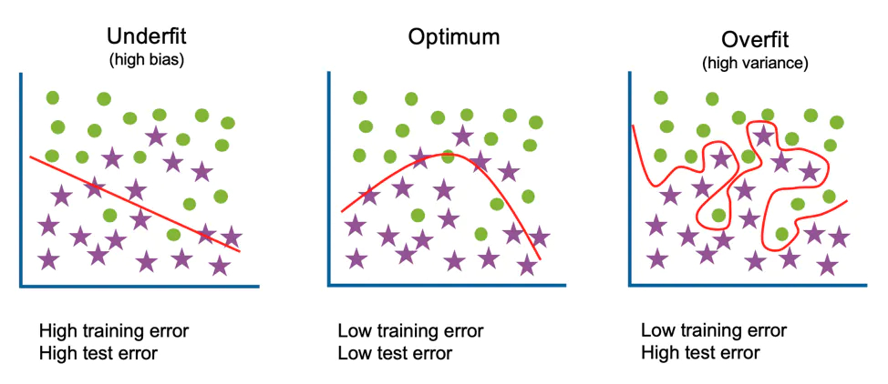
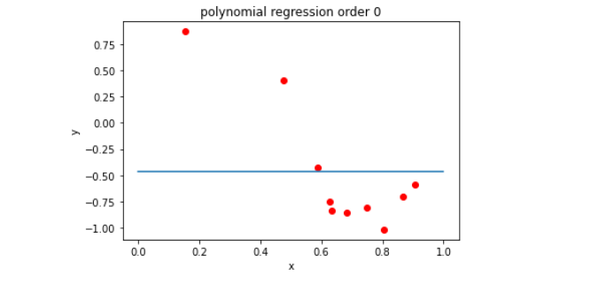
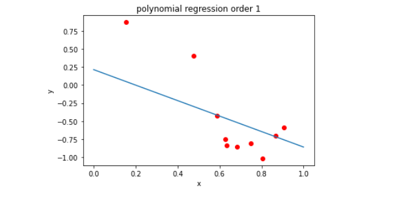
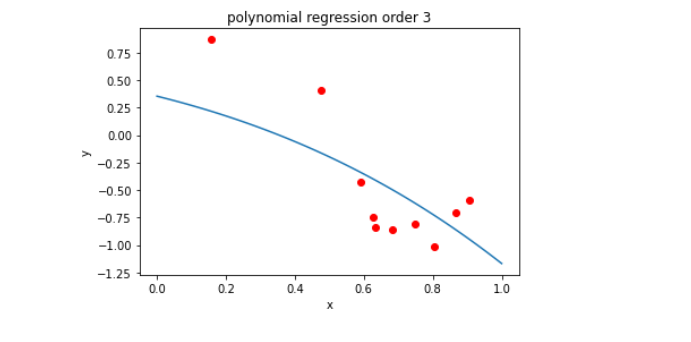
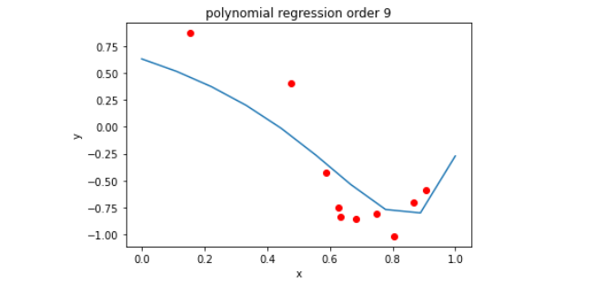
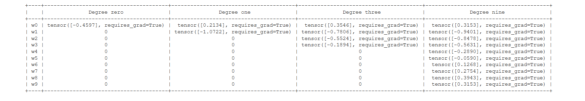
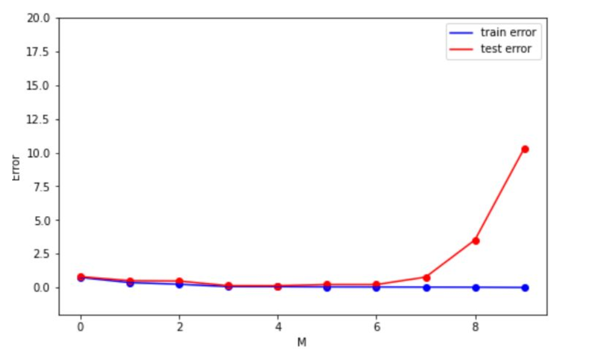
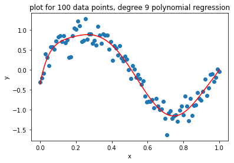

##  

 _Switch to dark mode for better readability_ 

### What is overfitting?

Overfitting is a concept in data science, which occurs when a statistical model fits exactly against its training data. When this happens, the algorithm unfortunately cannot perform accurately against unseen data, defeating its purpose. [_Source_](https://www.ibm.com/cloud/learn/overfitting)

### How is overfitting different from underfitting?

If overtraining or model complexity results in overfitting, then a logical prevention response would be either to pause training process earlier, also known as, “early stopping” or to reduce complexity in the model by eliminating less relevant inputs. However, if you pause too early or exclude too many important features, you may encounter the opposite problem, and instead, you may underfit your model. Underfitting occurs when the model has not trained for enough time or the input variables are not significant enough to determine a meaningful relationship between the input and output variables.  [_Source_](https://www.ibm.com/cloud/learn/overfitting)


[_Source_](https://www.ibm.com/cloud/learn/overfitting)

The goal of this project was to learn about the concept of overfitting using higher order linear regression.

Here is the link to the [Jupyter Notebook](https://github.com/saahilanande/overfitdatamining/blob/main/Anande_02.ipynb)

```python
import numpy as np
import matplotlib.pyplot as plt
import pandas as pd
```

### Generate 20 data pairs (X, Y) using y = sin(2*pi*X) + 0.1 * N 

We will generate 20 data points (x,y) using y = sin(2*pi*X) + 0.1 * N , X will be generated using uniform distribution and  N from the normal gaussian distribution. Further, we will divide them into 10 training set and 10 testing set

```python
Data=[]
X=[]
Y=[]
for i in range(20):
  x = np.random.uniform(0,1)
  n = np.random.normal()
  y = np.sin(2*3.142*x) + (n * 0.1)
  X.append(x)
  Y.append(y)
  Data.append([x,y])
```

```python
plt.hist(Y)
plt.title('values of y')
plt.show()

plt.hist(X)
plt.title('values of x')
plt.show()

plt.scatter(X,Y)
plt.title('all data points')
plt.xlabel('x')
plt.ylabel('y')
plt.show()
```


```python
data = np.array(Data)

train_x = np.array(data[:10,:1]).reshape(-1)
train_y = np.array(data[:10,1:2]).reshape(-1)
test_x = np.array(data[10:,:1]).reshape(-1)
test_y = np.array(data[10:,1:2]).reshape(-1)

print('TRAIN_X', train_x)
print('TRAIN_Y', train_y)
print('TEST_X',test_x)
print('TEST_Y',test_y)
```

    TRAIN_X [0.58959875 0.6333789  0.68250115 0.80349817 0.86787229 0.15575273
     0.74868447 0.90652823 0.6286243  0.47648693]
    TRAIN_Y [-0.42867108 -0.83522043 -0.8565866  -1.01694313 -0.70650818  0.87004055
     -0.80323613 -0.59228315 -0.75109396  0.40455545]
    TEST_X [0.59069239 0.04043644 0.53744204 0.22990134 0.10946096 0.5695794
     0.03354012 0.22669712 0.05717719 0.08498028]
    TEST_Y [-0.4615664   0.27488626 -0.13278931  0.96837151  0.71550714 -0.43112478
      0.12024006  1.01562863  0.39091251  0.65209704]


### Using root mean square error, find weights of polynomial regression for order is 0, 1, 3, 9

Using pytorch and loss function we would generate the weights and adjust the weight in each iteration when the loss is decreasing.


### POLYNOMIAL REGRESSION ORDER ZERO ###

```python
w0 = Variable(torch.Tensor([1.0]), requires_grad=True) # Any random value

newX = []
weight0=[0,0,0,0,0,0,0,0,0,0]
RMSETRAIN=[]

def forward(x):
    return w0 
    # + w2 * x * x + w3 + x * x * x

def loss(x,y):
  ycap = forward(x)
  return (ycap - y).pow(2).sum() 


for epoch in range(100):
  suml=0
  i=0
  for xval, yval in zip(train_x, train_y):
    i+=1
    l = loss(xval,yval)
    suml+=l.data.numpy()
    l.backward()
    w0.data = w0.data - 0.01 * w0.grad.data
    w0.grad.data.zero_()

  suml=suml/i
  suml = np.sqrt(suml)
 
print('RMSE = ', suml)
RMSETRAIN.append(suml)

print('WIEGHT ZERO = ' ,w0)
weight0[0]= w0

print("predict (before training)", train_x[0], forward(train_x[0]))
print("predict (before training)",train_x[1] , forward(train_x[1]))
print("predict (before training)", train_x[2], forward(train_x[2]))
print("predict (before training)", train_x[3], forward(train_x[3]))
print("predict (before training)",train_x[4] , forward(train_x[4]))
print("predict (before training)", train_x[5], forward(train_x[5]))
print("predict (before training)", train_x[6], forward(train_x[6]))
print("predict (before training)",train_x[7] , forward(train_x[7]))
print("predict (before training)", train_x[8], forward(train_x[8]))
print("predict (before training)", train_x[9], forward(train_x[9]))

plt.scatter(train_x,train_y,c='r')
plt.plot(X0,newX)
plt.title('polynomial regression order 0')
plt.xlabel('x')
plt.ylabel('y')
plt.show()


```

    RMSE =  0.5893791412888717
    WIEGHT ZERO =  tensor([-0.4597], requires_grad=True)
    predict (before training) 0.5895987509966687 tensor([-0.4597], requires_grad=True)
    predict (before training) 0.6333788950558974 tensor([-0.4597], requires_grad=True)
    predict (before training) 0.682501152563854 tensor([-0.4597], requires_grad=True)
    predict (before training) 0.8034981693828217 tensor([-0.4597], requires_grad=True)
    predict (before training) 0.8678722887659936 tensor([-0.4597], requires_grad=True)
    predict (before training) 0.15575272665283768 tensor([-0.4597], requires_grad=True)
    predict (before training) 0.7486844719729087 tensor([-0.4597], requires_grad=True)
    predict (before training) 0.9065282311302156 tensor([-0.4597], requires_grad=True)
    predict (before training) 0.6286242975627008 tensor([-0.4597], requires_grad=True)
    predict (before training) 0.47648692943445026 tensor([-0.4597], requires_grad=True)



### Observation

We can observe that when m = 0 we get a constant function which is represented by blue line. As we can see that blue line is not a good approximation for the underling scatter points of original sin function. This would lead to large error on training set so it cannot be good approximation to test set. The analysis of the graph shows the model is prone to underfit.Underfitting is the phenomenon that occurs when a model is not complex enough to actually model the true function 

### POLYNOMIAL REGRESSION ORDER ONE ### 

```python
w0 = Variable(torch.Tensor([1.0]), requires_grad=True) # Any random value
w1 = Variable(torch.Tensor([1.0]), requires_grad=True) # Any random value

newX = []
weight1=[0,0,0,0,0,0,0,0,0,0]

def forward(x):
    return w0 + w1 * x

def loss(x,y):
  ycap = forward(x)
  return (ycap - y).pow(2).sum() 


for epoch in range(100):
  suml=0
  i=0
  for xval, yval in zip(train_x, train_y):
    i+=1
    l = loss(xval,yval)
    suml+=l.data.numpy()
    l.backward()
    w0.data = w0.data - 0.01 * w0.grad.data
    w0.grad.data.zero_()
    w1.data = w1.data - 0.01 * w1.grad.data
    w1.grad.data.zero_()
```

    RMSE =  0.41960772035269017
    WIEGHT ZERO =  tensor([0.2134], requires_grad=True)
    WEIGHT one = tensor([-1.0722], requires_grad=True)
    predict (before training) 0.5895987509966687 tensor([-0.4187], grad_fn=<AddBackward0>)
    predict (before training) 0.6333788950558974 tensor([-0.4657], grad_fn=<AddBackward0>)
    predict (before training) 0.682501152563854 tensor([-0.5183], grad_fn=<AddBackward0>)
    predict (before training) 0.8034981693828217 tensor([-0.6481], grad_fn=<AddBackward0>)
    predict (before training) 0.8678722887659936 tensor([-0.7171], grad_fn=<AddBackward0>)
    predict (before training) 0.15575272665283768 tensor([0.0464], grad_fn=<AddBackward0>)
    predict (before training) 0.7486844719729087 tensor([-0.5893], grad_fn=<AddBackward0>)
    predict (before training) 0.9065282311302156 tensor([-0.7585], grad_fn=<AddBackward0>)
    predict (before training) 0.6286242975627008 tensor([-0.4606], grad_fn=<AddBackward0>)
    predict (before training) 0.47648692943445026 tensor([-0.2975], grad_fn=<AddBackward0>)
    


### observation

We can observe that when m = 1 we get a polynomial equation y(x,w) = W0 + w1x where w0 is our baise and w1 is the slope of the estimated signal which is represented by blue line. We can see that the line is still not a good approximation of the underline scatter points of original sin function. This would also give high error on the training data and the model is prone to underfit.


### POLYNOMIAL REGRESSION ORDER THREE ### 


```python
import torch
from torch import nn,optim
from torch.autograd import Variable

###REFRENCED FROM Lecture 04_ Back-propagation and PyTorch autograd.pdf ###

w0 = Variable(torch.Tensor([1.0]), requires_grad=True) # Any random value
w1 = Variable(torch.Tensor([1.0]), requires_grad=True) # Any random value
w2 = Variable(torch.Tensor([1.0]), requires_grad=True) # Any random value
w3 = Variable(torch.Tensor([1.0]), requires_grad=True) # Any random value
w4 = Variable(torch.Tensor([1.0]), requires_grad=True) # Any random value
w5 = Variable(torch.Tensor([1.0]), requires_grad=True) # Any random value

newX = []
suml=0
i=0
lostlist=[]
weight3=[0,0,0,0,0,0,0,0,0,0]

def forward(x):
    return w0 + w1 * x + w2 * x * x + w3 * x * x * x

def loss(x,y):
  ycap = forward(x)
  return (ycap - y).pow(2).sum()

for epoch in range(100):
  suml=0
  i=0
  for xval, yval in zip(train_x, train_y):
    i+=1
    l = loss(xval,yval)
    suml+=l.data.numpy()
    l.backward()
    w0.data = w0.data - 0.01 * w0.grad.data
    w0.grad.data.zero_()
    w1.data = w1.data - 0.01 * w1.grad.data
    w1.grad.data.zero_()
    w2.data = w2.data - 0.01 * w2.grad.data
    w2.grad.data.zero_()
    w3.data = w3.data - 0.01 * w3.grad.data
    w3.grad.data.zero_()
```


    WIEGHT ZERO =  tensor([0.3546], requires_grad=True)
    WEIGHT one = tensor([-0.7806], requires_grad=True)
    WEIGHT TWO tensor([-0.5524], requires_grad=True)
    WEIGHT THREE tensor([-0.1894], requires_grad=True)
    RMSE =  0.3875159033465206
    predict (before training) 0.5895987509966687 tensor([-0.3365], grad_fn=<AddBackward0>)
    predict (before training) 0.6333788950558974 tensor([-0.4096], grad_fn=<AddBackward0>)
    predict (before training) 0.682501152563854 tensor([-0.4957], grad_fn=<AddBackward0>)
    predict (before training) 0.8034981693828217 tensor([-0.7275], grad_fn=<AddBackward0>)
    predict (before training) 0.8678722887659936 tensor([-0.8627], grad_fn=<AddBackward0>)
    predict (before training) 0.15575272665283768 tensor([0.2189], grad_fn=<AddBackward0>)
    predict (before training) 0.7486844719729087 tensor([-0.6189], grad_fn=<AddBackward0>)
    predict (before training) 0.9065282311302156 tensor([-0.9481], grad_fn=<AddBackward0>)
    predict (before training) 0.6286242975627008 tensor([-0.4014], grad_fn=<AddBackward0>)
    predict (before training) 0.47648692943445026 tensor([-0.1633], grad_fn=<AddBackward0>)
    


### Observation

We can observe that when m = 3 we get a polynomial equation y(x,w) = W0 + w1x + w2x^2 + w3x^3. So now we can see that the blue curve is starting to be quit a good approximation to the underline scatter points of original sin function. Even though there are error on the training data but these error would be less that the error by the linear curve and constant curve.

### POLYNOMIAL REGRESSION ORDER NINE ### 


```python
w0 = Variable(torch.Tensor([1.0]), requires_grad=True) # Any random value
w1 = Variable(torch.Tensor([1.0]), requires_grad=True) # Any random value
w2 = Variable(torch.Tensor([1.0]), requires_grad=True) # Any random value
w3 = Variable(torch.Tensor([1.0]), requires_grad=True) # Any random value
w4 = Variable(torch.Tensor([1.0]), requires_grad=True) # Any random value
w5 = Variable(torch.Tensor([1.0]), requires_grad=True) # Any random value
w6 = Variable(torch.Tensor([1.0]), requires_grad=True) # Any random value
w7 = Variable(torch.Tensor([1.0]), requires_grad=True) # Any random value
w8 = Variable(torch.Tensor([1.0]), requires_grad=True) # Any random value
w9 = Variable(torch.Tensor([1.0]), requires_grad=True) # Any random value

newX = []
weight9=[0,0,0,0,0,0,0,0,0,0]

def forward(x):
    return w0 + w1 * x + w2 * x * x + w3 * x **3 + w4 *x **4 + w5* x **5 + w6 * x**6 + w7 *x**7 + w8 * x **8 + w9 + x **9

def loss(x,y):
  ycap = forward(x)
  return (ycap - y).pow(2).sum()


for epoch in range(100):
  suml=0
  i=0
  for xval, yval in zip(train_x, train_y):
    i+=1
    l = loss(xval,yval)
    suml+=l.data.numpy()
    l.backward()
    w0.data = w0.data - 0.01 * w0.grad.data
    w0.grad.data.zero_()
    w1.data = w1.data - 0.01 * w1.grad.data
    w1.grad.data.zero_()
    w2.data = w2.data - 0.01 * w2.grad.data
    w2.grad.data.zero_()
    w3.data = w3.data - 0.01 * w3.grad.data
    w3.grad.data.zero_()
    w4.data = w4.data - 0.01 * w4.grad.data
    w4.grad.data.zero_()
    w5.data = w5.data - 0.01 * w5.grad.data
    w5.grad.data.zero_()
    w6.data = w6.data - 0.01 * w6.grad.data
    w6.grad.data.zero_()
    w7.data = w7.data - 0.01 * w7.grad.data
    w7.grad.data.zero_()
    w8.data = w8.data - 0.01 * w8.grad.data
    w8.grad.data.zero_()
    w9.data = w9.data - 0.01 * w9.grad.data
    w9.grad.data.zero_()

```


    WIEGHT ZERO =  tensor([0.3153], requires_grad=True)
    WEIGHT one = tensor([-0.9401], requires_grad=True)
    WEIGHT TWO tensor([-0.8478], requires_grad=True)
    WEIGHT THREE tensor([-0.5631], requires_grad=True)
    WEIGHT FOUR tensor([-0.2890], requires_grad=True)
    WEIGHT FIVE tensor([-0.0590], requires_grad=True)
    WEIGHT SIX tensor([0.1268], requires_grad=True)
    WEIGHT SEVEN tensor([0.2754], requires_grad=True)
    WEIGHT EIGHT tensor([0.3943], requires_grad=True)
    WEIGHT NINE tensor([0.3153], requires_grad=True)
    RMSE =  0.29434764447373624
    predict (before training) 0.5895987509966687 tensor([-0.3465], grad_fn=<AddBackward0>)
    predict (before training) 0.6333788950558974 tensor([-0.4545], grad_fn=<AddBackward0>)
    predict (before training) 0.682501152563854 tensor([-0.5739], grad_fn=<AddBackward0>)
    predict (before training) 0.8034981693828217 tensor([-0.8027], grad_fn=<AddBackward0>)
    predict (before training) 0.8678722887659936 tensor([-0.8224], grad_fn=<AddBackward0>)
    predict (before training) 0.15575272665283768 tensor([0.4612], grad_fn=<AddBackward0>)
    predict (before training) 0.7486844719729087 tensor([-0.7180], grad_fn=<AddBackward0>)
    predict (before training) 0.9065282311302156 tensor([-0.7669], grad_fn=<AddBackward0>)
    predict (before training) 0.6286242975627008 tensor([-0.4428], grad_fn=<AddBackward0>)
    predict (before training) 0.47648692943445026 tensor([-0.0818], grad_fn=<AddBackward0>)




### Observation

Now if we keep on increasing the order of polynomial we should get better approximation. But if we increase the order to complex, Here M = 9 we can see that the blue curve starts to oscillate on each of the training data. so if we start increasing the order the error on the training set exactly becomes zero so the blue curve would give perfect fit for the training data points. But this is would not be good approximation of the under line true sin function and where ever we plug in a new data point it would fail to produce correct prediction. The model would hence be overfit, Overfitting is the opposite of underfitting, where a model is too complex for the data being modeled and thus additional artifacts such as noise may end up affecting the prediction more than the true function


### Displaying weights

```python
# https://www.geeksforgeeks.org/creating-tables-with-prettytable-library-python/

from prettytable import PrettyTable

pt = PrettyTable()
pt.add_column('',['w0','w1','w2','w3','w4','w5','w6','w7','w8','w9'])
pt.add_column('Degree zero' ,weight0)
pt.add_column('Degree one' ,weight1)
pt.add_column('Degree three' ,weight3)
pt.add_column('Degree nine' ,weight9)


print(pt)
```



### Draw train error vs test error


```python
degree=[0, 1, 3, 9]

plt.plot(degree,RMSETRAIN)
plt.scatter(degree,RMSETRAIN)
plt.plot(degree,RMSETEST, c='r')
plt.scatter(degree,RMSETEST, c='r')
plt.title('Train error')
plt.xlabel('MODEL ORDER')
plt.ylabel('RMSE')
plt.show()

```




### generate 100 more data and fit 9th order model and draw fit


```python
X100=[]
Y100=[]
data100=[]

for i in range(100):
  x100 = np.random.uniform(0,1)
  n100 = np.random.normal(0,1)
  y100 = np.sin(2*3.142*x100) + (n100 * 0.1)
  X100.append(x100)
  Y100.append(y100)
```

    showing values of Y :  [0.9915310383016898, 0.6601530950039405, 0.8302926897202694, 0.807257458487882, 0.7993569586685612, 0.6229643620400901, 0.7617517712697491, 0.9491050312211964, 0.4018684705195825, 0.43372615084685595, 0.7908144553988931, 0.8793281411042071, 0.362248774785379, 0.6130696388456689, 0.267590470615112, 0.9869726681329188, 0.7272330576083631, 0.6895316154549552, 0.29622752992877444, 0.22788492571596564, 0.04105965252442478, 0.6128557181915981, 0.024110431331409887, 0.7984688553675587, 0.45131447771449995, 0.3079111642258555, 0.13406944702152834, 0.698702628026026, 0.24485544327608266, 0.7442756716777882, 0.8376810497362471, 0.7045018082452233, 0.9284376127173981, 0.34912337762101064, 0.7916612978680062, 0.7065372496819562, 0.8704252511259509, 0.6420527160434791, 0.8622818841128475, 0.9429060728590494, 0.753204674490053, 0.938802432970327, 0.784932845571438, 0.5316382688190833, 0.29043603091303294, 0.17698505040488344, 0.8348847415408234, 0.9166258843400861, 0.8472036035630466, 0.3905059599566979, 0.3465719587014079, 0.46112684607091947, 0.7854898370121638, 0.30662742265241916, 0.4250693233174295, 0.9171761166240752, 0.49523437398237724, 0.7285393254537599, 0.7693318003252934, 0.6010777197503303, 0.3619087979595088, 0.5531063508054782, 0.20574627901121034, 0.8683999433656069, 0.034465842308171846, 0.02671288683598172, 0.5890981399967247, 0.7657816182253613, 0.35729856529779924, 0.7920593043901111, 0.4013897962811759, 0.3438041531337658, 0.8667669158058195, 0.24376382472048652, 0.7683475170574577, 0.316652331900387, 0.6311088660902404, 0.4080786141064495, 0.11080582362975988, 0.8289716970382638, 0.940768411574112, 0.81342419691067, 0.8592882785840164, 0.5884321245352222, 0.8453904667881861, 0.8786884312693236, 0.9724864347261638, 0.2423496459194936, 0.04549130345087449, 0.36090522532820146, 0.2725918243249946, 0.6407128572658558, 0.33029273916484403, 0.5338810745096708, 0.7822493376352905, 0.39649335289417953, 0.4907556774389715, 0.14799142304076418, 0.03313133781589539, 0.23869899648295978]
    


     showing values of X :  [-0.10453153748715191, -1.0400363645303885, -0.8535408947790633, -0.9849054427729056, -0.8611220299615225, -0.8882635269480375, -0.8569227137352726, -0.3127422192193498, 0.473013850176006, 0.2764667565805188, -0.8687785213349634, -0.5653061430857994, 0.8771702928430484, -0.6643703369844021, 0.9691463304145237, -0.14467994128938272, -1.015691652947397, -0.9464153285948337, 1.0249460121830118, 0.9504526864219411, 0.18646315567924213, -0.5296211442281803, 0.20962136927351882, -1.0956211929395931, 0.4635777690957832, 0.9951007731189181, 0.9949321993333462, -0.8367987141726885, 1.0075351586654637, -0.9417768959405749, -0.9110444339552564, -0.9618633777889404, -0.5615309932198858, 0.9724191895070544, -1.0779062765583833, -1.0327737298810555, -0.6250414756064447, -0.9122427329695214, -0.7674787005251035, -0.32131562833499794, -0.8044670488660386, -0.470588560627615, -0.9553369124241687, -0.21383558093423935, 0.8921975217049699, 0.8534203856479496, -0.6623139891215526, -0.5827129394978314, -0.7127887703798769, 0.7075948392598367, 0.975168940862966, 0.19592379139089705, -1.0442516046751604, 0.8920884358523539, 0.3763145634286107, -0.543308029363738, 0.05521967578868045, -1.0070899812220597, -0.7881939276573322, -0.5578236061621806, 0.8664265208975337, -0.24865552180913142, 1.0994899460745946, -0.7341768270858002, 0.4215334310275749, 0.07957725340608364, -0.6013258570059632, -0.9404504603257546, 0.8643994029930415, -1.028584296088671, 0.4806511063712019, 0.7940037925261993, -0.7731529984390735, 1.0048579779449525, -0.8018590993333246, 0.7797962989312418, -0.6326914472403491, 0.5537699068554518, 0.7057969925876186, -0.8885157175122426, -0.27894037904179353, -0.8822509413279913, -0.6820549318073819, -0.5076906443216823, -0.8512910234504406, -0.7378269497928828, -0.188515875454808, 1.1048413034926456, 0.3157730562348591, 1.0014861114719749, 0.9699416435127447, -0.7132913654616275, 0.9146376217358693, -0.1587425086977783, -1.0209293507307762, 0.6566603916085945, 0.13442770783736863, 0.7685847024590746, 0.14824952977866918, 0.9368117632693251]


```python
X0 = np.linspace(0,1,100)
for x in X0:
  newX.append(forward(x).detach())


plt.scatter(X100,Y100,c='r')
plt.plot(X0,newX)
plt.title('polynomial regression order 9')
plt.xlabel('x')
plt.ylabel('y')
plt.show()
```


### observation

Now if we increase the amount of data set, graph above that the model takes on a form much more similar to the sin function than previously with less data points.


### Challenges faced:

Initially I struggled with implimenting gradient descent on different polynomial order. I started with manually writing the gradient decent d loss by d w for each polynomial order, but [this blog]https://discuss.pytorch.org/t/rmse-loss-function/16540 and lecture slides (Lecture 04_ Back-propagation and PyTorch autograd.pdf) helped me understand the concept and how to implement it.

While adding the weights of the polynomials to the pretty table, i had to pad zeroes to it, to make all of them of the same length. But doing so messed up the weights of all the polynomials because it was a referenced variable. Using the .copy() function solved that problem for me.


Doing this project helped clarify my concepts of overfitting and discover a way to prevent it from happening.


### References:

[1] https://vitalflux.com/wp-content/uploads/2020/12/overfitting-and-underfitting-wrt-model-error-vs-complexity.png

[2] https://www.ibm.com/cloud/learn/overfitting

[3] https://www.youtube.com/watch?v=4JQR9k2OXcw   

[4] https://www.geeksforgeeks.org/python-implementation-of-polynomial-regression/

[5] https://moonbooks.org/Articles/How-to-implement-a-polynomial-linear-regression-using-scikit-learn-and-python-3-/

[6] https://stackoverflow.com/questions/47303261/getting-weights-of-features-using-scikit-learn-logistic-regression

[7] https://stackoverflow.com/questions/38191855/zero-pad-numpy-array

[8] https://www.geeksforgeeks.org/creating-tables-with-prettytable-library-python/

[9] https://discuss.pytorch.org/t/rmse-loss-function/16540
l


