```python
import numpy as np
import matplotlib.pyplot as plt
```

###Generate 20 data pairs (X, Y) using y = sin(2*pi*X) + 0.1 * N 


```python
# rand = np.random.RandomState(20) 
x=np.random.uniform(0,1,20)
print('showing values of x : ',x)

plt.hist(x)
plt.title('values of x')
plt.show()

N=np.random.normal(size=20)
print('showing values of N : ',N)

plt.hist(N)
plt.title('values of N')
plt.show()

```

    showing values of x :  [0.5065955  0.11412767 0.52634393 0.13430513 0.12141921 0.08835001
     0.51724323 0.00444379 0.89216408 0.74439585 0.18419264 0.72286723
     0.59523432 0.95187964 0.27695679 0.43505269 0.95398647 0.33320902
     0.64479291 0.63948439]
    


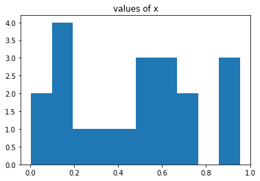


    showing values of N :  [ 1.06510773  0.70313713 -0.45806236 -0.78857958 -0.52984258 -0.84608916
      1.07215212  1.11489313  0.11948624  1.02859731  0.44568169  0.24444456
     -0.86562125 -0.30561877  1.55021314  0.42619426 -0.56210217  0.62200473
      1.00214438  0.03476018]
    


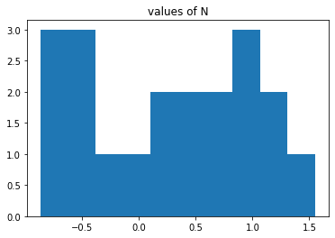


```python
import math
y=[]
for i in range(20):
  # print(i)
  y.append((math.sin(x[i]*3.142*2))+(N[i])*0.2)
print('Values of y : ',y)

plt.hist(y)
plt.title('values of y')
plt.show()

plt.scatter(x,y)
plt.title('all data points')
plt.xlabel('x')
plt.ylabel('y')
plt.show()
```

    Values of y :  [0.17118032297090804, 0.7978880906437485, -0.256804412241356, 0.5895734297086033, 0.5851231274205356, 0.3578881765720981, 0.10588092999601144, 0.25089975161344724, -0.6024247587809445, -0.7936818285922409, 1.0049247993821213, -0.936714234036075, -0.736825317156796, -0.35814693610200166, 1.2956949620125484, 0.4817575235401146, -0.3967761741926047, 0.9906810553573294, -0.5892503704887883, -0.7618254109321836]
    


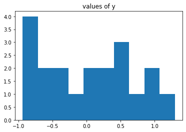


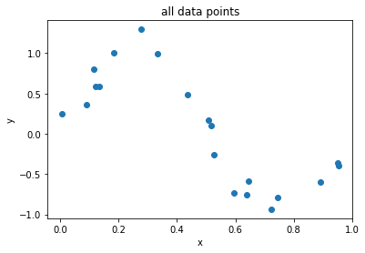


```python
train_y=[]
test_y=[]
train_x=[]
test_x=[]
for i in range(20):
  if(i%2==0):
    train_y.append(y[i])
    train_x.append(x[i])
  else:
    test_y.append(y[i])
    test_x.append(x[i])

print("training set for y : ",train_y)
print("training set for x : ",train_x)
print("test set for y : ",test_y)
print("test set for x : ",test_x)

train_y=np.array(train_y)
test_y=np.array(test_y)
train_x=np.array(train_x)
test_x=np.array(test_x)

train_x=train_x.reshape(-1, 1)
train_y=train_y.reshape(-1, 1)
test_x=test_x.reshape(-1,1)
test_y=test_y.reshape(-1,1)


# plt.scatter(x,train_y)
# plt.title('Training data points')
# plt.xlabel('x')
# plt.ylabel('y')
# plt.show()

# plt.scatter(x,test_set)
# plt.title('Training data points')
# plt.xlabel('x')
# plt.ylabel('y')
# plt.show()


```

    training set for y :  [0.17118032297090804, -0.256804412241356, 0.5851231274205356, 0.10588092999601144, -0.6024247587809445, 1.0049247993821213, -0.736825317156796, 1.2956949620125484, -0.3967761741926047, -0.5892503704887883]
    training set for x :  [0.5065954955910669, 0.5263439330297612, 0.1214192124185125, 0.5172432303376305, 0.8921640831936551, 0.18419264043506622, 0.5952343194155714, 0.2769567933749101, 0.9539864651937019, 0.6447929132040842]
    test set for y :  [0.7978880906437485, 0.5895734297086033, 0.3578881765720981, 0.25089975161344724, -0.7936818285922409, -0.936714234036075, -0.35814693610200166, 0.4817575235401146, 0.9906810553573294, -0.7618254109321836]
    test set for x :  [0.11412767018169767, 0.13430512749327617, 0.08835000898166301, 0.004443786589970133, 0.7443958469077984, 0.7228672268923204, 0.9518796439477641, 0.43505269159444815, 0.33320901738865893, 0.6394843916912883]
    


```python
from sklearn.preprocessing import PolynomialFeatures
from sklearn.pipeline import make_pipeline
from sklearn.linear_model import LinearRegression
from sklearn.pipeline import Pipeline
from sklearn.preprocessing import StandardScaler
from sklearn.metrics import r2_score
from sklearn.metrics import mean_squared_error
```

###Using root mean square error, find weights of polynomial regression for order is 0, 1, 3, 9


```python
# train_x=np.array(train_x)
# train_y=np.array(train_y)
# train_x.reshape(-1)
# train_y.reshape(-1)


# reference : https://moonbooks.org/Articles/How-to-implement-a-polynomial-linear-regression-using-scikit-learn-and-python-3-/
def Regression(i):
    polynomial_features = PolynomialFeatures(degree = i)
    x_transf=polynomial_features.fit_transform(train_x)
    
    model=LinearRegression()
    model.fit(x_transf,train_y)

    y_new=model.predict(x_transf)

    #training error
    rmse=np.sqrt(mean_squared_error(train_y,y_new))
    #test error
    rmse2=np.sqrt(mean_squared_error(test_y,y_new))
    
    r2=r2_score(test_y,y_new)
    
    print('RMSE of degree ',i,': ',rmse2)
    print('R2 of degree ',i,': ',r2)

    return polynomial_features, model


```


```python
polynomial0, model0 = Regression(0)
weights0=model0.coef_ #https://stackoverflow.com/questions/47303261/getting-weights-of-features-using-scikit-learn-logistic-regression
w0=weights0.copy()
w0.resize(10,refcheck=False) #https://stackoverflow.com/questions/38191855/zero-pad-numpy-array
print('weights for degree 0: ',w0)

polynomial1, model1 = Regression(1)
weights1=model1.coef_  
w1=weights1.copy()
w1.resize(10,refcheck=False)
print('weights for degree 1: ',w1)

polynomial3, model3 = Regression(3)
weights3=model3.coef_
w3=weights3.copy()
w3.resize(10,refcheck=False)
print('weights for degree 3: ',w3)

polynomial9, model9 = Regression(9)
weights9=model9.coef_
w9=weights9.copy()
w9.resize(10,refcheck=False)
print('weights for degree 9: ',w9)

```

    RMSE of degree  0 :  0.6757748998054574
    R2 of degree  0 :  -3.095311539746959e-05
    weights for degree 0:  [0. 0. 0. 0. 0. 0. 0. 0. 0. 0.]
    RMSE of degree  1 :  0.8812007036292655
    R2 of degree  1 :  -0.700430943644264
    weights for degree 1:  [ 0.         -2.08588249  0.          0.          0.          0.
      0.          0.          0.          0.        ]
    RMSE of degree  3 :  0.8288670295347729
    R2 of degree  3 :  -0.5044545024311573
    weights for degree 3:  [  0.          19.13481046 -49.59044887  31.84488751   0.
       0.           0.           0.           0.           0.        ]
    RMSE of degree  9 :  0.88028613143296
    R2 of degree  9 :  -0.6969031211504679
    weights for degree 9:  [ 0.00000000e+00 -5.15004633e+05  5.62522625e+06 -3.33866950e+07
      1.19621482e+08 -2.70415048e+08  3.88273313e+08 -3.43304079e+08
      1.70341143e+08 -3.62628790e+07]
    

###Display weights in table


```python
# https://www.geeksforgeeks.org/creating-tables-with-prettytable-library-python/

from prettytable import PrettyTable

mytable=PrettyTable()

columns=['','Order 0','Order 1','Order 3','Order 9']

mytable.add_column(columns[0],['W0','W1','W2','W3','W4','W5','W6','W7','W8','W9'])
mytable.add_column(columns[1],w0)
mytable.add_column(columns[2],w1)
mytable.add_column(columns[3],w3)
mytable.add_column(columns[4],w9)

print(mytable)
```

    +----+---------+--------------------+---------------------+---------------------+
    |    | Order 0 |      Order 1       |       Order 3       |       Order 9       |
    +----+---------+--------------------+---------------------+---------------------+
    | W0 |   0.0   |        0.0         |         0.0         |         0.0         |
    | W1 |   0.0   | -2.085882487390529 |  19.134810457045457 | -515004.63279339066 |
    | W2 |   0.0   |        0.0         | -49.590448870417305 |  5625226.251401764  |
    | W3 |   0.0   |        0.0         |  31.844887505116315 | -33386695.008260697 |
    | W4 |   0.0   |        0.0         |         0.0         |  119621482.41552813 |
    | W5 |   0.0   |        0.0         |         0.0         |  -270415047.5128739 |
    | W6 |   0.0   |        0.0         |         0.0         |  388273313.46595275 |
    | W7 |   0.0   |        0.0         |         0.0         |  -343304079.1551127 |
    | W8 |   0.0   |        0.0         |         0.0         |  170341143.46188554 |
    | W9 |   0.0   |        0.0         |         0.0         |  -36262879.02721146 |
    +----+---------+--------------------+---------------------+---------------------+
    

###Draw a chart of fit data


```python
xnew=np.linspace(0,1,100)
xnew=np.array(xnew)
xnew=xnew.reshape(-1,1)

x_trans0=polynomial0.fit_transform(xnew)
y0=model0.predict(x_trans0)
plt.scatter(x,y)
plt.plot(xnew,y0,c='r')
plt.title('polynomial regression order 0')
plt.xlabel('x')
plt.ylabel('y')
plt.show()


x_trans1=polynomial1.fit_transform(xnew)
y1=model1.predict(x_trans1)
plt.scatter(x,y)
plt.plot(xnew,y1,c='r')
plt.title('polynomial regression order 1')
plt.xlabel('x')
plt.ylabel('y')
plt.show()

x_trans3=polynomial3.fit_transform(xnew)
y3=model3.predict(x_trans3)
plt.scatter(x,y)
plt.plot(xnew,y3,c='r')
plt.title('polynomial regression order 3')
plt.xlabel('x')
plt.ylabel('y')
plt.show()

x_trans9=polynomial9.fit_transform(xnew)
y9=model9.predict(x_trans9)
plt.scatter(x,y)
plt.plot(xnew,y9,c='r')
plt.title('polynomial regression order 9')
plt.xlabel('x')
plt.ylabel('y')
plt.show()

```


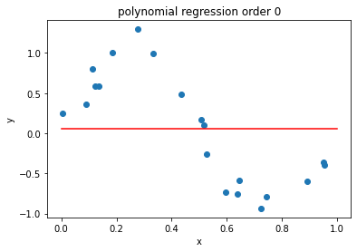


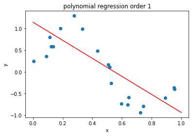


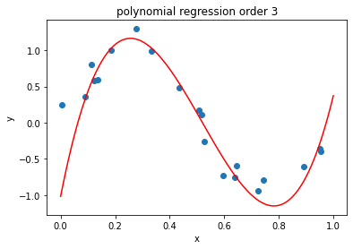


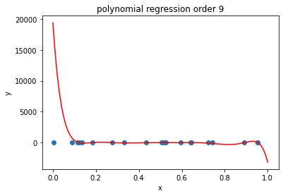


###Draw train error vs test error


```python
train_errors=[]
test_errors=[]
# print(test_x.shape)
# print(test_y.shape)

for i in range (0,10):
  polynomial_features = PolynomialFeatures(degree = i)
  x_transf=polynomial_features.fit_transform(train_x)
    
  model=LinearRegression()
  model.fit(x_transf,train_y)

  y_new=model.predict(x_transf)

  #training error
  rmse=np.sqrt(mean_squared_error(train_y,y_new))
  #test error
  x_transf=polynomial_features.fit_transform(test_x)
  y_new=model.predict(x_transf)
  rmse2=np.sqrt(mean_squared_error(test_y,y_new))

  train_errors.append(rmse)
  test_errors.append(rmse2)


print(train_errors)
print(test_errors)
models= np.linspace(0, 9, 10)
plt.plot(models,train_errors,label = 'train error', color = 'blue')
plt.plot(models,test_errors,label = 'test error', color = 'red')
plt.title('Train vs test error')
plt.xlabel('polynomial regression order')
plt.ylabel('RMSE')
plt.legend()
plt.show()


```

    [0.6718839839061639, 0.3949820650144116, 0.362185294183138, 0.15509957090719734, 0.1257616863153283, 0.11667502425249053, 0.11033312782105564, 0.05139960801508042, 0.045984709291081345, 2.7116532461094445e-08]
    [0.6757748998054574, 0.5130767396803901, 0.6430332529224712, 0.40209758302055293, 0.7368997594930184, 0.3663105838641724, 0.5101256658169809, 6.711239341941148, 37.9374792351037, 5445.918996816799]
    


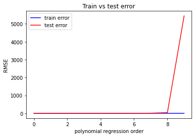


###generate 100 more data and fit 9th order model and draw fit


```python
# x2=np.random.uniform(0,1,100)
x2=np.linspace(0,1,100)
n2=np.random.normal(size=100)

print('showing values of x : ',x2)

plt.hist(x2)
plt.title('values of x2')
plt.show()

print('showing values of n2 : ',n2)

plt.hist(n2)
plt.title('values of n2')
plt.show()

```

    showing values of x :  [0.         0.01010101 0.02020202 0.03030303 0.04040404 0.05050505
     0.06060606 0.07070707 0.08080808 0.09090909 0.1010101  0.11111111
     0.12121212 0.13131313 0.14141414 0.15151515 0.16161616 0.17171717
     0.18181818 0.19191919 0.2020202  0.21212121 0.22222222 0.23232323
     0.24242424 0.25252525 0.26262626 0.27272727 0.28282828 0.29292929
     0.3030303  0.31313131 0.32323232 0.33333333 0.34343434 0.35353535
     0.36363636 0.37373737 0.38383838 0.39393939 0.4040404  0.41414141
     0.42424242 0.43434343 0.44444444 0.45454545 0.46464646 0.47474747
     0.48484848 0.49494949 0.50505051 0.51515152 0.52525253 0.53535354
     0.54545455 0.55555556 0.56565657 0.57575758 0.58585859 0.5959596
     0.60606061 0.61616162 0.62626263 0.63636364 0.64646465 0.65656566
     0.66666667 0.67676768 0.68686869 0.6969697  0.70707071 0.71717172
     0.72727273 0.73737374 0.74747475 0.75757576 0.76767677 0.77777778
     0.78787879 0.7979798  0.80808081 0.81818182 0.82828283 0.83838384
     0.84848485 0.85858586 0.86868687 0.87878788 0.88888889 0.8989899
     0.90909091 0.91919192 0.92929293 0.93939394 0.94949495 0.95959596
     0.96969697 0.97979798 0.98989899 1.        ]
    


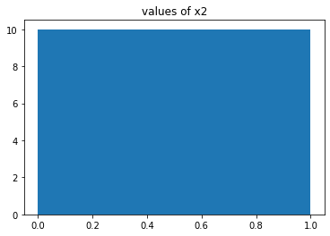


    showing values of n2 :  [-1.55866377e+00 -1.36082128e+00 -1.05110994e+00  1.04086891e+00
      2.96452186e-01 -1.05815554e+00  1.02215584e+00  7.60582413e-01
      1.95520316e-01  9.15855074e-01  1.19469760e+00  1.08410113e+00
      1.03857214e-01  5.98172298e-01 -4.46541456e-01 -2.80242879e-01
     -2.67079929e+00 -2.78362843e+00 -2.52092922e-01  5.87267337e-01
      3.51216092e-01  1.26619371e+00  6.17943671e-01 -1.44713393e+00
     -1.25583113e+00  1.42049206e+00 -1.11409691e+00 -4.55209331e-01
     -3.44930931e-01 -1.46415939e+00 -1.04930766e+00 -1.52506917e+00
      1.02117993e+00  6.25609487e-02 -8.40164086e-01  5.24914195e-01
      6.09723066e-01  8.19633625e-01 -7.27630828e-01  4.75948243e-01
     -1.64089928e+00  4.39467458e-01  4.21874275e-01 -1.34377280e-01
      1.33547374e+00  5.53856620e-02 -2.54380300e-04  9.48876627e-01
      8.90043657e-01 -1.78931297e-01 -9.16446072e-01  9.90562129e-01
      8.88212853e-01  1.69680671e-01  8.14319143e-01  6.12007163e-01
      1.39683318e-01  8.71915540e-01 -7.63908904e-01 -1.17811912e+00
     -9.17932742e-01 -6.39680044e-01 -1.90497738e-01 -9.99193965e-01
      3.64166255e-01 -3.91968107e-01 -7.05899449e-01 -4.43756310e-01
      6.40494524e-01 -1.40481471e+00 -3.35706079e+00 -5.48380794e-01
     -2.11144296e-01 -1.10600220e+00 -7.95820110e-01 -6.79240687e-01
     -1.52953134e+00 -1.60538107e-01  3.29946743e-01 -8.81889112e-01
      1.35867475e+00 -4.08459188e-03 -2.02817090e+00  6.65982192e-01
     -1.67109931e+00 -6.05020469e-01 -7.24295867e-01  5.95801125e-01
     -4.20600058e-01 -8.75747834e-01  1.25075185e-02  1.26851542e+00
     -1.08861724e+00 -3.87161159e-01  9.77170225e-01  7.82021728e-01
     -4.89046218e-01 -2.81539170e-01  3.93538608e-01 -2.13785821e-01]
    


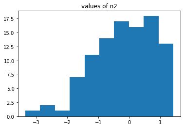


```python
y2=[]
for i in range(100):
  # print(i)
  y2.append((math.sin(x2[i]*3.142*2))+(n2[i])*0.2)
print('Values of y2 : ',y2)

plt.hist(y2)
plt.title('values of y2')
plt.show()

plt.scatter(x2,y2)
plt.title('scatter plot of 100 data points')
plt.show()

x2=np.array(x2)
y2=np.array(y2)
x2=x2.reshape(-1,1)
y2=y2.reshape(-1,1)


```

    Values of y2 :  [-0.3117327532333845, -0.2087321237010215, -0.08361320756022472, 0.3974492687128643, 0.3104702861353639, 0.10044142819925178, 0.5761394617072048, 0.581963406665068, 0.5253583271126174, 0.7238741365917095, 0.8319137142946355, 0.8596771765088341, 0.7109219200919744, 0.8542987508380389, 0.6869108133829285, 0.7585989713174226, 0.3156349828291035, 0.32479373814101953, 0.8592749347810785, 1.0516571172768014, 1.0251943153815195, 1.225091038921837, 1.1084279088007505, 0.7044326395540844, 0.7477104914536655, 1.283969255314285, 0.7740184140652548, 0.8987479304584214, 0.909769042934862, 0.6709466594277712, 0.7350585124815525, 0.6172418704097319, 1.1001127901453875, 0.8784017794561514, 0.6643820215540022, 0.9005702172282631, 0.8775001506965499, 0.8764072775392451, 0.5210097503891915, 0.713096327364823, 0.23860884836693852, 0.6012813720422497, 0.5422941436365291, 0.37373088330499327, 0.608774620541279, 0.29245435537410486, 0.21989039772205776, 0.34739479455999395, 0.2726715533827463, -0.0044613573266350515, -0.2154283991453561, 0.10263860107351973, 0.01921864488010891, -0.1867998099519069, -0.11929507784064178, -0.22004398728221192, -0.37341600521489854, -0.2842602853864343, -0.666868624877389, -0.8030835349977477, -0.8021335754328731, -0.7950790350602879, -0.7511515268655266, -0.9559277723581943, -0.7232474356255517, -0.9112596483739628, -1.0074767301682954, -0.9849897395880294, -0.7944714385077226, -1.2261493220746884, -1.6354076579703123, -1.0885981012869317, -1.0321344493944529, -1.218102643406947, -1.1590476261102738, -1.1346859192184795, -1.2996752179980313, -1.0168051446232313, -0.9056706908267995, -1.1310868317006366, -0.6621777570024268, -0.9101718097941586, -1.286768655718661, -0.7161686849729711, -1.1483946530370577, -0.8967093068368315, -0.8789705081713302, -0.5704004580374775, -0.7263527052172503, -0.7674675565155138, -0.5375161080715276, -0.23183912558195263, -0.6468346412811318, -0.44838408248155437, -0.11586438306168112, -0.09398684596579335, -0.28628470022161423, -0.18210843498848756, 0.01608866247606501, -0.041942471431624724]
    


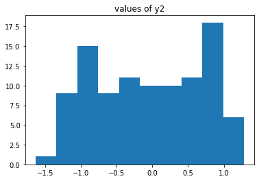


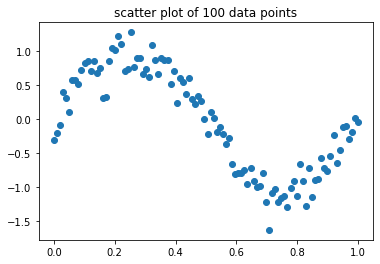


```python
polynomial_features2=PolynomialFeatures(degree=9)
x_transf2=polynomial_features2.fit_transform(x2)
model2=LinearRegression()
model2.fit(x_transf2,y2)

y2new=model2.predict(x_transf2)

xnew=np.linspace(0,1,100)
plt.plot(xnew,y2new,c='r')
plt.scatter(x2,y2)
plt.title('plot for 100 data points, degree 9 polynomial regression')
plt.xlabel('x')
plt.ylabel('y')
plt.show

```


    <function matplotlib.pyplot.show>


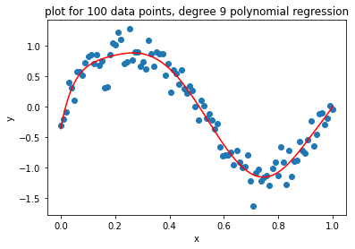


###Now we will regularize using the sum of weights


```python
from sklearn.linear_model import Ridge
#https://inria.github.io/scikit-learn-mooc/python_scripts/linear_models_regularization.html
def l2ridge(x2,y2,alpha):
  # x2=x2.reshape(100,1)
  # y2=y2.reshape(100,1)  
  # polynomial_features3=PolynomialFeatures(degree=9)
  ridge = make_pipeline(PolynomialFeatures(degree=9),
                      Ridge(alpha=alpha))
  # transform=polynomial_features3.fit_transform(x2)
  # ridge=Ridge(alpha=alpha)
  ridge.fit(x2,y2)
  result=ridge.predict(x2)
  return result

```

###Draw chart for lambda is 1, 1/10, 1/100, 1/1000, 1/10000, 1/100000


```python
y2new1=l2ridge(x2,y2,1)
plt.scatter(x2,y2)
plt.plot(xnew,y2new1,c='r')
plt.title('lambda=1')
plt.xlabel('x')
plt.ylabel('y')
plt.show()

y2new10=l2ridge(x2,y2,1/10)
plt.scatter(x2,y2)
plt.plot(xnew,y2new10,c='r')
plt.title('lambda=1/10')
plt.xlabel('x')
plt.ylabel('y')
plt.show()

y2new100=l2ridge(x2,y2,1/100)
plt.scatter(x2,y2)
plt.plot(xnew,y2new100,c='r')
plt.title('lambda=1/100')
plt.xlabel('x')
plt.ylabel('y')
plt.show()

y2new1000=l2ridge(x2,y2,1/1000)
plt.scatter(x2,y2)
plt.plot(xnew,y2new1000,c='r')
plt.title('lambda=1/1000')
plt.xlabel('x')
plt.ylabel('y')
plt.show()

y2new10000=l2ridge(x2,y2,1/10000)
plt.scatter(x2,y2)
plt.plot(xnew,y2new10000,c='r')
plt.title('lambda=1/10000')
plt.xlabel('x')
plt.ylabel('y')
plt.show()

y2new100000=l2ridge(x2,y2,1/100000)
plt.scatter(x2,y2)
plt.plot(xnew,y2new100000,c='r')
plt.title('lambda=1/100000')
plt.xlabel('x')
plt.ylabel('y')
plt.show()

y2new1000000000=l2ridge(x2,y2,1/1000000000)
plt.scatter(x2,y2)
plt.plot(xnew,y2new1000000000,c='r')
plt.title('lambda=1/1000000000')
plt.xlabel('x')
plt.ylabel('y')
plt.show()


```


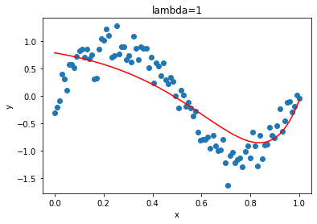


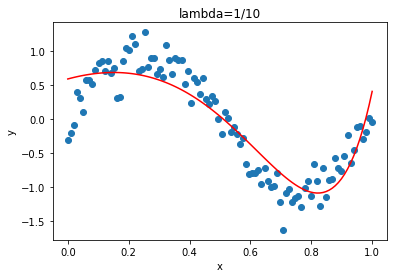


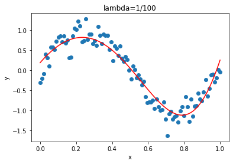


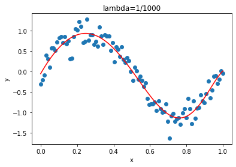


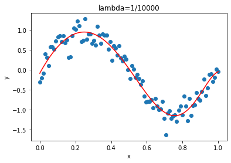


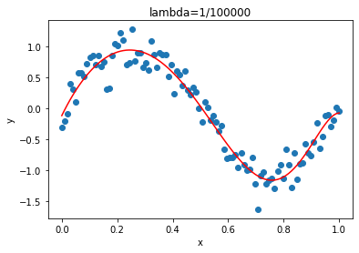


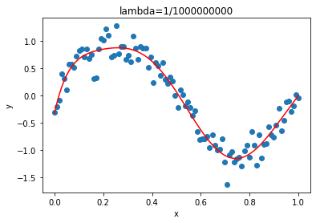


###Now draw test  and train error according to lamda 


```python
regularised_train_error=[]
regularised_test_error=[]
alphas=[1,1/10,1/100,1/1000,1/10000,1/100000,1/1000000,1/10000000,1/100000000,1/1000000000]
for alpha in alphas:
  
  # polynomial_features = PolynomialFeatures(degree = i)
  # x_transf=polynomial_features.fit_transform(train_x)
    
  # model=LinearRegression()
  # model.fit(x_transf,train_y)

  # y_new=model.predict(x_transf)
  ridge = make_pipeline(PolynomialFeatures(degree=9),
                      Ridge(alpha=alpha))
  ridge.fit(train_x,train_y)
  ynew=ridge.predict(train_x)

  #training error
  rmse=np.sqrt(mean_squared_error(train_y,ynew))
  #test error
  y2newtest=ridge.predict(test_x)
  rmse2=np.sqrt(mean_squared_error(test_y,y2newtest))

  regularised_train_error.append(rmse)
  regularised_test_error.append(rmse2)


print(train_errors)
print(test_errors)
logalpha=[np.log(1),np.log(1/10),np.log(1/100),np.log(1/1000),np.log(1/10000),np.log(1/100000),np.log(1/1000000),np.log(1/10000000),np.log(1/100000000),np.log(1/1000000000)]
plt.plot(logalpha,regularised_train_error,label = 'train error', color = 'blue')
plt.plot(logalpha,regularised_test_error,label = 'test error', color = 'red')
plt.title('train vs test error for regularized ')
plt.xlabel('ln(lambda)')
plt.ylabel('error')
plt.legend()
plt.show()
```

    [0.6718839839061639, 0.3949820650144116, 0.362185294183138, 0.15509957090719734, 0.1257616863153283, 0.11667502425249053, 0.11033312782105564, 0.05139960801508042, 0.045984709291081345, 2.7116532461094445e-08]
    [0.6757748998054574, 0.5130767396803901, 0.6430332529224712, 0.40209758302055293, 0.7368997594930184, 0.3663105838641724, 0.5101256658169809, 6.711239341941148, 37.9374792351037, 5445.918996816799]
    


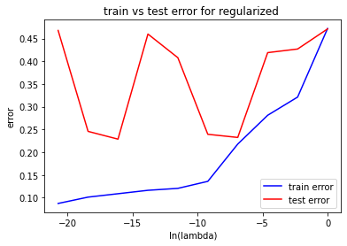


###Based on best performance my model will be the one with *lambda 1/1000000* because here the difference between train and test error is almost negligible, it has lowest test error compared to other models, and the error is lesser than the error of the model with lambda 1/1000000000.


```python

```
