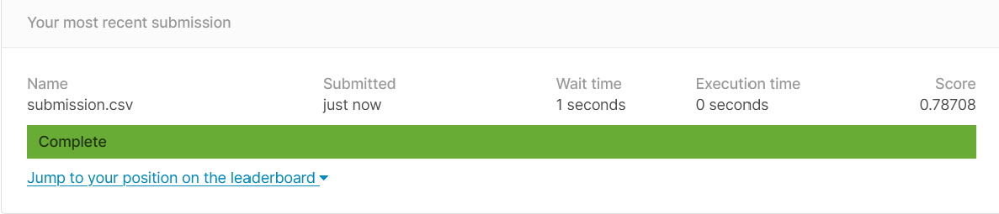

##  

 _Switch to dark mode for better readability_ 

#### About the Challenge :

we are given 3 files in the data, (1) train.csv, (2) test.csv, and (3) gender_submission.csv. The challenge is to use the Titanic passenger data (name, age, price of ticket, etc) to try to predict who will survive and who will die. We have to use training data set (train.csv) to find pattern that would help us predict whether the passengers in test.csv survived. After exploring the pattern in the data set we submit the best result to the challenge.

#### Hypothesis score : 0.77511

#### Final submission _improved_ score : 0.78708

[Scroll down to view the relevant code snippets, or click here to view the notebook on Kaggle](https://www.kaggle.com/saahilanande/saahildataminingprojecttutorial)

#### My Contribution and changes:  

After the first submission of the default code provided by Kaggle, I obtained a score of 0.77511. To figure out how I could improve this performance I decided to look at other submissions in the competition and browse the web. While doing so I came across [Ken Jee's tutorial on youtube.](https://www.youtube.com/watch?v=I3FBJdiExcg&list=WL&index=1&ab_channel=KenJee) After going through the tutorial and other submissions I realize that dealing with the null values in the data set could significantly improve the score of the submission, So I explore the data set further and found out that the columns which have Null values were (1)'Age', (2)'Cabin' and (3)'Embarked'. After checking the data type and what value does each category have, I followed the key things taught in the data mining basics, how to replace the missing values.

Since the data type of 'Age' was float I decided to take the mean of the entire column and replace the missing values of age with the mean of the age. Since the data type of 'Embarked' was object and only 2 values were missing I replaced the missing value with the most repeated value in that category which was 'S'. Now in the column Cabin, the data type was object and there were lots of missing values so I decided to not include that feature in the random forest classifier.

Similarly, i explored the test data set for Null values and found out that the columns which have Null value were (1)'Age', (2)'Cabin' and (3)'Fair'. For 'Age' I chose to replace the missing value with Mean and since there was only 1 missing value for 'Fair' i decided to replace the missing value with the mode. After running the model with this change and submitting it I was able to increase my score to 0.78708. A small change in score but I did learn from it nevertheless.

