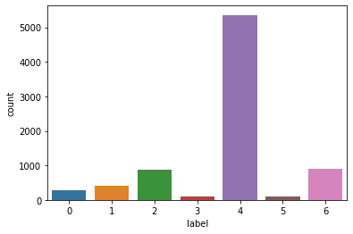

```python
import pandas as pd
import numpy as np
```


```python
from google.colab import drive
drive.mount("/content/drive/")
```

    Mounted at /content/drive/
    


```python
#Dataset used: https://www.kaggle.com/kmader/skin-cancer-mnist-ham10000
path='/content/drive/My Drive/Colab Notebooks/Skin Cancer/hmnist_28_28_RGB.csv'

```


```python
df=pd.read_csv(path)
```


```python
df.tail()
```


<div>
<style scoped>
    .dataframe tbody tr th:only-of-type {
        vertical-align: middle;
    }

    .dataframe tbody tr th {
        vertical-align: top;
    }

    .dataframe thead th {
        text-align: right;
    }
</style>
<table border="1" class="dataframe">
  <thead>
    <tr style="text-align: right;">
      <th></th>
      <th>pixel0000</th>
      <th>pixel0001</th>
      <th>pixel0002</th>
      <th>pixel0003</th>
      <th>pixel0004</th>
      <th>pixel0005</th>
      <th>pixel0006</th>
      <th>pixel0007</th>
      <th>pixel0008</th>
      <th>pixel0009</th>
      <th>pixel0010</th>
      <th>pixel0011</th>
      <th>pixel0012</th>
      <th>pixel0013</th>
      <th>pixel0014</th>
      <th>pixel0015</th>
      <th>pixel0016</th>
      <th>pixel0017</th>
      <th>pixel0018</th>
      <th>pixel0019</th>
      <th>pixel0020</th>
      <th>pixel0021</th>
      <th>pixel0022</th>
      <th>pixel0023</th>
      <th>pixel0024</th>
      <th>pixel0025</th>
      <th>pixel0026</th>
      <th>pixel0027</th>
      <th>pixel0028</th>
      <th>pixel0029</th>
      <th>pixel0030</th>
      <th>pixel0031</th>
      <th>pixel0032</th>
      <th>pixel0033</th>
      <th>pixel0034</th>
      <th>pixel0035</th>
      <th>pixel0036</th>
      <th>pixel0037</th>
      <th>pixel0038</th>
      <th>pixel0039</th>
      <th>...</th>
      <th>pixel2313</th>
      <th>pixel2314</th>
      <th>pixel2315</th>
      <th>pixel2316</th>
      <th>pixel2317</th>
      <th>pixel2318</th>
      <th>pixel2319</th>
      <th>pixel2320</th>
      <th>pixel2321</th>
      <th>pixel2322</th>
      <th>pixel2323</th>
      <th>pixel2324</th>
      <th>pixel2325</th>
      <th>pixel2326</th>
      <th>pixel2327</th>
      <th>pixel2328</th>
      <th>pixel2329</th>
      <th>pixel2330</th>
      <th>pixel2331</th>
      <th>pixel2332</th>
      <th>pixel2333</th>
      <th>pixel2334</th>
      <th>pixel2335</th>
      <th>pixel2336</th>
      <th>pixel2337</th>
      <th>pixel2338</th>
      <th>pixel2339</th>
      <th>pixel2340</th>
      <th>pixel2341</th>
      <th>pixel2342</th>
      <th>pixel2343</th>
      <th>pixel2344</th>
      <th>pixel2345</th>
      <th>pixel2346</th>
      <th>pixel2347</th>
      <th>pixel2348</th>
      <th>pixel2349</th>
      <th>pixel2350</th>
      <th>pixel2351</th>
      <th>label</th>
    </tr>
  </thead>
  <tbody>
    <tr>
      <th>10010</th>
      <td>183</td>
      <td>165</td>
      <td>181</td>
      <td>182</td>
      <td>165</td>
      <td>180</td>
      <td>184</td>
      <td>166</td>
      <td>182</td>
      <td>188</td>
      <td>168</td>
      <td>182</td>
      <td>181</td>
      <td>157</td>
      <td>162</td>
      <td>205</td>
      <td>179</td>
      <td>188</td>
      <td>221</td>
      <td>199</td>
      <td>214</td>
      <td>224</td>
      <td>202</td>
      <td>215</td>
      <td>226</td>
      <td>201</td>
      <td>205</td>
      <td>223</td>
      <td>198</td>
      <td>206</td>
      <td>230</td>
      <td>207</td>
      <td>219</td>
      <td>228</td>
      <td>201</td>
      <td>211</td>
      <td>229</td>
      <td>203</td>
      <td>210</td>
      <td>223</td>
      <td>...</td>
      <td>225</td>
      <td>197</td>
      <td>195</td>
      <td>222</td>
      <td>193</td>
      <td>193</td>
      <td>228</td>
      <td>199</td>
      <td>202</td>
      <td>231</td>
      <td>202</td>
      <td>204</td>
      <td>227</td>
      <td>203</td>
      <td>206</td>
      <td>230</td>
      <td>211</td>
      <td>219</td>
      <td>231</td>
      <td>217</td>
      <td>223</td>
      <td>222</td>
      <td>204</td>
      <td>207</td>
      <td>202</td>
      <td>179</td>
      <td>180</td>
      <td>205</td>
      <td>180</td>
      <td>181</td>
      <td>208</td>
      <td>185</td>
      <td>187</td>
      <td>208</td>
      <td>186</td>
      <td>186</td>
      <td>206</td>
      <td>187</td>
      <td>189</td>
      <td>0</td>
    </tr>
    <tr>
      <th>10011</th>
      <td>2</td>
      <td>3</td>
      <td>1</td>
      <td>38</td>
      <td>33</td>
      <td>32</td>
      <td>121</td>
      <td>104</td>
      <td>103</td>
      <td>132</td>
      <td>111</td>
      <td>107</td>
      <td>130</td>
      <td>108</td>
      <td>104</td>
      <td>136</td>
      <td>112</td>
      <td>111</td>
      <td>148</td>
      <td>125</td>
      <td>125</td>
      <td>155</td>
      <td>132</td>
      <td>134</td>
      <td>157</td>
      <td>132</td>
      <td>132</td>
      <td>164</td>
      <td>138</td>
      <td>137</td>
      <td>187</td>
      <td>161</td>
      <td>161</td>
      <td>198</td>
      <td>172</td>
      <td>173</td>
      <td>202</td>
      <td>175</td>
      <td>175</td>
      <td>209</td>
      <td>...</td>
      <td>207</td>
      <td>179</td>
      <td>179</td>
      <td>195</td>
      <td>164</td>
      <td>162</td>
      <td>197</td>
      <td>168</td>
      <td>169</td>
      <td>203</td>
      <td>176</td>
      <td>180</td>
      <td>192</td>
      <td>165</td>
      <td>165</td>
      <td>188</td>
      <td>162</td>
      <td>162</td>
      <td>184</td>
      <td>162</td>
      <td>164</td>
      <td>185</td>
      <td>162</td>
      <td>163</td>
      <td>161</td>
      <td>137</td>
      <td>135</td>
      <td>155</td>
      <td>132</td>
      <td>129</td>
      <td>96</td>
      <td>79</td>
      <td>76</td>
      <td>24</td>
      <td>23</td>
      <td>21</td>
      <td>3</td>
      <td>4</td>
      <td>1</td>
      <td>0</td>
    </tr>
    <tr>
      <th>10012</th>
      <td>132</td>
      <td>118</td>
      <td>118</td>
      <td>167</td>
      <td>149</td>
      <td>149</td>
      <td>175</td>
      <td>156</td>
      <td>160</td>
      <td>184</td>
      <td>164</td>
      <td>167</td>
      <td>195</td>
      <td>173</td>
      <td>175</td>
      <td>210</td>
      <td>191</td>
      <td>199</td>
      <td>212</td>
      <td>195</td>
      <td>201</td>
      <td>210</td>
      <td>189</td>
      <td>193</td>
      <td>218</td>
      <td>194</td>
      <td>203</td>
      <td>217</td>
      <td>191</td>
      <td>195</td>
      <td>217</td>
      <td>195</td>
      <td>199</td>
      <td>224</td>
      <td>201</td>
      <td>203</td>
      <td>236</td>
      <td>211</td>
      <td>215</td>
      <td>250</td>
      <td>...</td>
      <td>200</td>
      <td>169</td>
      <td>165</td>
      <td>217</td>
      <td>183</td>
      <td>179</td>
      <td>241</td>
      <td>211</td>
      <td>210</td>
      <td>242</td>
      <td>216</td>
      <td>215</td>
      <td>239</td>
      <td>214</td>
      <td>213</td>
      <td>234</td>
      <td>208</td>
      <td>208</td>
      <td>224</td>
      <td>198</td>
      <td>196</td>
      <td>206</td>
      <td>180</td>
      <td>177</td>
      <td>226</td>
      <td>202</td>
      <td>201</td>
      <td>214</td>
      <td>192</td>
      <td>190</td>
      <td>204</td>
      <td>181</td>
      <td>178</td>
      <td>181</td>
      <td>159</td>
      <td>153</td>
      <td>172</td>
      <td>151</td>
      <td>145</td>
      <td>0</td>
    </tr>
    <tr>
      <th>10013</th>
      <td>160</td>
      <td>124</td>
      <td>146</td>
      <td>164</td>
      <td>131</td>
      <td>152</td>
      <td>167</td>
      <td>127</td>
      <td>146</td>
      <td>169</td>
      <td>124</td>
      <td>142</td>
      <td>173</td>
      <td>134</td>
      <td>149</td>
      <td>177</td>
      <td>139</td>
      <td>156</td>
      <td>181</td>
      <td>141</td>
      <td>159</td>
      <td>183</td>
      <td>137</td>
      <td>154</td>
      <td>185</td>
      <td>139</td>
      <td>160</td>
      <td>185</td>
      <td>145</td>
      <td>165</td>
      <td>186</td>
      <td>148</td>
      <td>162</td>
      <td>189</td>
      <td>157</td>
      <td>170</td>
      <td>190</td>
      <td>155</td>
      <td>169</td>
      <td>191</td>
      <td>...</td>
      <td>189</td>
      <td>141</td>
      <td>159</td>
      <td>192</td>
      <td>167</td>
      <td>179</td>
      <td>193</td>
      <td>173</td>
      <td>183</td>
      <td>192</td>
      <td>171</td>
      <td>181</td>
      <td>190</td>
      <td>164</td>
      <td>171</td>
      <td>190</td>
      <td>162</td>
      <td>171</td>
      <td>190</td>
      <td>168</td>
      <td>179</td>
      <td>194</td>
      <td>177</td>
      <td>187</td>
      <td>192</td>
      <td>170</td>
      <td>180</td>
      <td>186</td>
      <td>163</td>
      <td>165</td>
      <td>185</td>
      <td>162</td>
      <td>167</td>
      <td>184</td>
      <td>157</td>
      <td>166</td>
      <td>185</td>
      <td>162</td>
      <td>172</td>
      <td>0</td>
    </tr>
    <tr>
      <th>10014</th>
      <td>175</td>
      <td>142</td>
      <td>121</td>
      <td>181</td>
      <td>150</td>
      <td>134</td>
      <td>181</td>
      <td>150</td>
      <td>133</td>
      <td>178</td>
      <td>145</td>
      <td>127</td>
      <td>177</td>
      <td>144</td>
      <td>122</td>
      <td>177</td>
      <td>146</td>
      <td>123</td>
      <td>179</td>
      <td>148</td>
      <td>126</td>
      <td>185</td>
      <td>157</td>
      <td>140</td>
      <td>177</td>
      <td>142</td>
      <td>113</td>
      <td>174</td>
      <td>138</td>
      <td>112</td>
      <td>177</td>
      <td>141</td>
      <td>117</td>
      <td>175</td>
      <td>139</td>
      <td>108</td>
      <td>178</td>
      <td>145</td>
      <td>117</td>
      <td>181</td>
      <td>...</td>
      <td>183</td>
      <td>150</td>
      <td>136</td>
      <td>178</td>
      <td>141</td>
      <td>116</td>
      <td>184</td>
      <td>151</td>
      <td>135</td>
      <td>188</td>
      <td>160</td>
      <td>147</td>
      <td>183</td>
      <td>153</td>
      <td>131</td>
      <td>180</td>
      <td>146</td>
      <td>131</td>
      <td>173</td>
      <td>137</td>
      <td>115</td>
      <td>157</td>
      <td>88</td>
      <td>68</td>
      <td>146</td>
      <td>32</td>
      <td>47</td>
      <td>145</td>
      <td>24</td>
      <td>48</td>
      <td>159</td>
      <td>79</td>
      <td>82</td>
      <td>174</td>
      <td>137</td>
      <td>125</td>
      <td>175</td>
      <td>139</td>
      <td>126</td>
      <td>6</td>
    </tr>
  </tbody>
</table>
<p>5 rows × 2353 columns</p>
</div>


```python
#reference https://github.com/rohanmandrekar/Cifar-10-/blob/master/best_attempt%28model7%29.ipynb

fractions=np.array([0.8,0.2])
df=df.sample(frac=1)
train_set, test_set = np.array_split(
    df, (fractions[:-1].cumsum() * len(df)).astype(int))
```


```python
print(len(train_set))
```

    8012
    


```python
print(len(test_set))
```

    2003
    


```python
df.label.unique()
```


    array([6, 4, 2, 0, 1, 5, 3])


```python
# reference: https://www.kaggle.com/kmader/skin-cancer-mnist-ham10000/discussion/183083
classes={0:('akiec', 'actinic keratoses and intraepithelial carcinomae'),
         1:('bcc' , 'basal cell carcinoma'),
         2:('bkl', 'benign keratosis-like lesions'),
         3:('df', 'dermatofibroma'),
         4:('nv', ' melanocytic nevi'),
         5:('vasc', ' pyogenic granulomas and hemorrhage'),
         6:('mel', 'melanoma'),}
```


```python
y_train=train_set['label']
x_train=train_set.drop(columns=['label'])
y_test=test_set['label']
x_test=test_set.drop(columns=['label'])

columns=list(x_train)
```


```python
import torch
device = torch.device("cuda:0" if torch.cuda.is_available() else "cpu")
print(device)
```

    cuda:0
    


```python
import seaborn as sns

sns.countplot(train_set['label'])
```

    /usr/local/lib/python3.7/dist-packages/seaborn/_decorators.py:43: FutureWarning: Pass the following variable as a keyword arg: x. From version 0.12, the only valid positional argument will be `data`, and passing other arguments without an explicit keyword will result in an error or misinterpretation.
      FutureWarning
    


    <matplotlib.axes._subplots.AxesSubplot at 0x7f69de190490>





```python
from imblearn.over_sampling import RandomOverSampler 
oversample = RandomOverSampler()
x_train,y_train  = oversample.fit_resample(x_train,y_train)
```

    /usr/local/lib/python3.7/dist-packages/sklearn/externals/six.py:31: FutureWarning: The module is deprecated in version 0.21 and will be removed in version 0.23 since we've dropped support for Python 2.7. Please rely on the official version of six (https://pypi.org/project/six/).
      "(https://pypi.org/project/six/).", FutureWarning)
    /usr/local/lib/python3.7/dist-packages/sklearn/utils/deprecation.py:144: FutureWarning: The sklearn.neighbors.base module is  deprecated in version 0.22 and will be removed in version 0.24. The corresponding classes / functions should instead be imported from sklearn.neighbors. Anything that cannot be imported from sklearn.neighbors is now part of the private API.
      warnings.warn(message, FutureWarning)
    /usr/local/lib/python3.7/dist-packages/sklearn/utils/deprecation.py:87: FutureWarning: Function safe_indexing is deprecated; safe_indexing is deprecated in version 0.22 and will be removed in version 0.24.
      warnings.warn(msg, category=FutureWarning)
    


```python
sns.countplot(y_train)
```

    /usr/local/lib/python3.7/dist-packages/seaborn/_decorators.py:43: FutureWarning: Pass the following variable as a keyword arg: x. From version 0.12, the only valid positional argument will be `data`, and passing other arguments without an explicit keyword will result in an error or misinterpretation.
      FutureWarning
    


    <matplotlib.axes._subplots.AxesSubplot at 0x7f69da1100d0>


```python
import matplotlib.pyplot as plt
import random
num=random.randint(0,8000)
x_train=np.array(x_train, dtype=np.uint8).reshape(-1,28,28,3)

plt.imshow(x_train[num].reshape(28,28,3))
plt.title("Random image from training data")
plt.show()
num=random.randint(0,8000)
plt.imshow(x_train[num].reshape(28,28,3))
plt.title("Random image from training data")
plt.show()

num=random.randint(0,8000)
plt.imshow(x_train[num].reshape(28,28,3))
plt.title("Random image from training data")
plt.show()
```


```python
from tensorflow.keras.models import Sequential
from tensorflow.keras.layers import Conv2D, Flatten, Dense, MaxPool2D
import tensorflow as tf
```


```python
model = Sequential()
model.add(Conv2D(16, kernel_size = (3,3), input_shape = (28, 28, 3), activation = 'relu', padding = 'same'))
model.add(MaxPool2D(pool_size = (2,2)))
model.add(tf.keras.layers.BatchNormalization())
model.add(Conv2D(32, kernel_size = (3,3), activation = 'relu'))
model.add(Conv2D(64, kernel_size = (3,3), activation = 'relu'))
model.add(MaxPool2D(pool_size = (2,2)))
model.add(tf.keras.layers.BatchNormalization())
model.add(Conv2D(128, kernel_size = (3,3), activation = 'relu'))
model.add(Conv2D(256, kernel_size = (3,3), activation = 'relu'))
model.add(Flatten())
model.add(tf.keras.layers.Dropout(0.2))
model.add(Dense(256,activation='relu'))
model.add(tf.keras.layers.BatchNormalization())
model.add(tf.keras.layers.Dropout(0.2))
model.add(Dense(128,activation='relu'))
model.add(tf.keras.layers.BatchNormalization())
model.add(Dense(64,activation='relu'))
model.add(tf.keras.layers.BatchNormalization())
model.add(tf.keras.layers.Dropout(0.2))
model.add(Dense(32,activation='relu'))
model.add(tf.keras.layers.BatchNormalization())
model.add(Dense(7,activation='softmax'))

model.summary()
```

    Model: "sequential"
    _________________________________________________________________
    Layer (type)                 Output Shape              Param #   
    =================================================================
    conv2d (Conv2D)              (None, 28, 28, 16)        448       
    _________________________________________________________________
    max_pooling2d (MaxPooling2D) (None, 14, 14, 16)        0         
    _________________________________________________________________
    batch_normalization (BatchNo (None, 14, 14, 16)        64        
    _________________________________________________________________
    conv2d_1 (Conv2D)            (None, 12, 12, 32)        4640      
    _________________________________________________________________
    conv2d_2 (Conv2D)            (None, 10, 10, 64)        18496     
    _________________________________________________________________
    max_pooling2d_1 (MaxPooling2 (None, 5, 5, 64)          0         
    _________________________________________________________________
    batch_normalization_1 (Batch (None, 5, 5, 64)          256       
    _________________________________________________________________
    conv2d_3 (Conv2D)            (None, 3, 3, 128)         73856     
    _________________________________________________________________
    conv2d_4 (Conv2D)            (None, 1, 1, 256)         295168    
    _________________________________________________________________
    flatten (Flatten)            (None, 256)               0         
    _________________________________________________________________
    dropout (Dropout)            (None, 256)               0         
    _________________________________________________________________
    dense (Dense)                (None, 256)               65792     
    _________________________________________________________________
    batch_normalization_2 (Batch (None, 256)               1024      
    _________________________________________________________________
    dropout_1 (Dropout)          (None, 256)               0         
    _________________________________________________________________
    dense_1 (Dense)              (None, 128)               32896     
    _________________________________________________________________
    batch_normalization_3 (Batch (None, 128)               512       
    _________________________________________________________________
    dense_2 (Dense)              (None, 64)                8256      
    _________________________________________________________________
    batch_normalization_4 (Batch (None, 64)                256       
    _________________________________________________________________
    dropout_2 (Dropout)          (None, 64)                0         
    _________________________________________________________________
    dense_3 (Dense)              (None, 32)                2080      
    _________________________________________________________________
    batch_normalization_5 (Batch (None, 32)                128       
    _________________________________________________________________
    dense_4 (Dense)              (None, 7)                 231       
    =================================================================
    Total params: 504,103
    Trainable params: 502,983
    Non-trainable params: 1,120
    _________________________________________________________________
    


```python
#reference: https://www.kaggle.com/dhruv1234/ham10000-skin-disease-classification
callback = tf.keras.callbacks.ModelCheckpoint(filepath='/content/drive/My Drive/Colab Notebooks/Skin Cancer/best_model.h5',
                                                  monitor='val_acc', mode='max',
                                                 verbose=1, save_best_only=True)
```


```python
optimizer=tf.keras.optimizers.Adam(lr=0.001)
model.compile(loss = 'sparse_categorical_crossentropy',
             optimizer =optimizer,
              metrics = ['accuracy'])
history = model.fit(x_train,
                    y_train,
                    validation_split=0.2,
                    batch_size = 128,
                    epochs = 50,
                    shuffle=True,
                    callbacks=[callback])
```

    Epoch 1/50
    235/235 [==============================] - 36s 12ms/step - loss: 1.5915 - accuracy: 0.4160 - val_loss: 2.8865 - val_accuracy: 0.0317
    WARNING:tensorflow:Can save best model only with val_acc available, skipping.
    Epoch 2/50
    235/235 [==============================] - 2s 9ms/step - loss: 0.4993 - accuracy: 0.8372 - val_loss: 1.4458 - val_accuracy: 0.4121
    WARNING:tensorflow:Can save best model only with val_acc available, skipping.
    Epoch 3/50
    235/235 [==============================] - 2s 9ms/step - loss: 0.2724 - accuracy: 0.9103 - val_loss: 1.3315 - val_accuracy: 0.4002
    WARNING:tensorflow:Can save best model only with val_acc available, skipping.
    Epoch 4/50
    235/235 [==============================] - 2s 9ms/step - loss: 0.2234 - accuracy: 0.9224 - val_loss: 0.8266 - val_accuracy: 0.5951
    WARNING:tensorflow:Can save best model only with val_acc available, skipping.
    Epoch 5/50
    235/235 [==============================] - 2s 9ms/step - loss: 0.1792 - accuracy: 0.9377 - val_loss: 1.0320 - val_accuracy: 0.7162
    WARNING:tensorflow:Can save best model only with val_acc available, skipping.
    Epoch 6/50
    235/235 [==============================] - 2s 9ms/step - loss: 0.1638 - accuracy: 0.9436 - val_loss: 0.5715 - val_accuracy: 0.7312
    WARNING:tensorflow:Can save best model only with val_acc available, skipping.
    Epoch 7/50
    235/235 [==============================] - 2s 9ms/step - loss: 0.1149 - accuracy: 0.9597 - val_loss: 0.8722 - val_accuracy: 0.5806
    WARNING:tensorflow:Can save best model only with val_acc available, skipping.
    Epoch 8/50
    235/235 [==============================] - 2s 9ms/step - loss: 0.1169 - accuracy: 0.9606 - val_loss: 0.8624 - val_accuracy: 0.6242
    WARNING:tensorflow:Can save best model only with val_acc available, skipping.
    Epoch 9/50
    235/235 [==============================] - 2s 9ms/step - loss: 0.0889 - accuracy: 0.9690 - val_loss: 1.3489 - val_accuracy: 0.5624
    WARNING:tensorflow:Can save best model only with val_acc available, skipping.
    Epoch 10/50
    235/235 [==============================] - 2s 9ms/step - loss: 0.0935 - accuracy: 0.9681 - val_loss: 0.5333 - val_accuracy: 0.7601
    WARNING:tensorflow:Can save best model only with val_acc available, skipping.
    Epoch 11/50
    235/235 [==============================] - 2s 9ms/step - loss: 0.0787 - accuracy: 0.9733 - val_loss: 1.0674 - val_accuracy: 0.6154
    WARNING:tensorflow:Can save best model only with val_acc available, skipping.
    Epoch 12/50
    235/235 [==============================] - 2s 9ms/step - loss: 0.0581 - accuracy: 0.9806 - val_loss: 0.7218 - val_accuracy: 0.7056
    WARNING:tensorflow:Can save best model only with val_acc available, skipping.
    Epoch 13/50
    235/235 [==============================] - 2s 9ms/step - loss: 0.0739 - accuracy: 0.9746 - val_loss: 0.6832 - val_accuracy: 0.7364
    WARNING:tensorflow:Can save best model only with val_acc available, skipping.
    Epoch 14/50
    235/235 [==============================] - 2s 9ms/step - loss: 0.0558 - accuracy: 0.9818 - val_loss: 1.3406 - val_accuracy: 0.6397
    WARNING:tensorflow:Can save best model only with val_acc available, skipping.
    Epoch 15/50
    235/235 [==============================] - 2s 9ms/step - loss: 0.0748 - accuracy: 0.9762 - val_loss: 0.4244 - val_accuracy: 0.8587
    WARNING:tensorflow:Can save best model only with val_acc available, skipping.
    Epoch 16/50
    235/235 [==============================] - 2s 9ms/step - loss: 0.0532 - accuracy: 0.9808 - val_loss: 0.3187 - val_accuracy: 0.8658
    WARNING:tensorflow:Can save best model only with val_acc available, skipping.
    Epoch 17/50
    235/235 [==============================] - 2s 9ms/step - loss: 0.0407 - accuracy: 0.9871 - val_loss: 0.3234 - val_accuracy: 0.8772
    WARNING:tensorflow:Can save best model only with val_acc available, skipping.
    Epoch 18/50
    235/235 [==============================] - 2s 9ms/step - loss: 0.0349 - accuracy: 0.9891 - val_loss: 1.5362 - val_accuracy: 0.5190
    WARNING:tensorflow:Can save best model only with val_acc available, skipping.
    Epoch 19/50
    235/235 [==============================] - 2s 9ms/step - loss: 0.0528 - accuracy: 0.9819 - val_loss: 0.3450 - val_accuracy: 0.8330
    WARNING:tensorflow:Can save best model only with val_acc available, skipping.
    Epoch 20/50
    235/235 [==============================] - 2s 9ms/step - loss: 0.0425 - accuracy: 0.9848 - val_loss: 0.5082 - val_accuracy: 0.8306
    WARNING:tensorflow:Can save best model only with val_acc available, skipping.
    Epoch 21/50
    235/235 [==============================] - 2s 9ms/step - loss: 0.0378 - accuracy: 0.9878 - val_loss: 0.5035 - val_accuracy: 0.8462
    WARNING:tensorflow:Can save best model only with val_acc available, skipping.
    Epoch 22/50
    235/235 [==============================] - 2s 9ms/step - loss: 0.0322 - accuracy: 0.9886 - val_loss: 0.6385 - val_accuracy: 0.7912
    WARNING:tensorflow:Can save best model only with val_acc available, skipping.
    Epoch 23/50
    235/235 [==============================] - 2s 9ms/step - loss: 0.0333 - accuracy: 0.9895 - val_loss: 0.6843 - val_accuracy: 0.7942
    WARNING:tensorflow:Can save best model only with val_acc available, skipping.
    Epoch 24/50
    235/235 [==============================] - 2s 9ms/step - loss: 0.0308 - accuracy: 0.9895 - val_loss: 0.1519 - val_accuracy: 0.9382
    WARNING:tensorflow:Can save best model only with val_acc available, skipping.
    Epoch 25/50
    235/235 [==============================] - 2s 9ms/step - loss: 0.0242 - accuracy: 0.9916 - val_loss: 0.6080 - val_accuracy: 0.8289
    WARNING:tensorflow:Can save best model only with val_acc available, skipping.
    Epoch 26/50
    235/235 [==============================] - 2s 9ms/step - loss: 0.0299 - accuracy: 0.9904 - val_loss: 0.2495 - val_accuracy: 0.9038
    WARNING:tensorflow:Can save best model only with val_acc available, skipping.
    Epoch 27/50
    235/235 [==============================] - 2s 9ms/step - loss: 0.0291 - accuracy: 0.9906 - val_loss: 0.4722 - val_accuracy: 0.8502
    WARNING:tensorflow:Can save best model only with val_acc available, skipping.
    Epoch 28/50
    235/235 [==============================] - 2s 9ms/step - loss: 0.0268 - accuracy: 0.9909 - val_loss: 0.2086 - val_accuracy: 0.9247
    WARNING:tensorflow:Can save best model only with val_acc available, skipping.
    Epoch 29/50
    235/235 [==============================] - 2s 9ms/step - loss: 0.0243 - accuracy: 0.9917 - val_loss: 0.9127 - val_accuracy: 0.7722
    WARNING:tensorflow:Can save best model only with val_acc available, skipping.
    Epoch 30/50
    235/235 [==============================] - 2s 9ms/step - loss: 0.0208 - accuracy: 0.9934 - val_loss: 2.0540 - val_accuracy: 0.5503
    WARNING:tensorflow:Can save best model only with val_acc available, skipping.
    Epoch 31/50
    235/235 [==============================] - 2s 9ms/step - loss: 0.0285 - accuracy: 0.9906 - val_loss: 0.3010 - val_accuracy: 0.9186
    WARNING:tensorflow:Can save best model only with val_acc available, skipping.
    Epoch 32/50
    235/235 [==============================] - 2s 9ms/step - loss: 0.0249 - accuracy: 0.9923 - val_loss: 0.1280 - val_accuracy: 0.9520
    WARNING:tensorflow:Can save best model only with val_acc available, skipping.
    Epoch 33/50
    235/235 [==============================] - 2s 9ms/step - loss: 0.0211 - accuracy: 0.9928 - val_loss: 0.5762 - val_accuracy: 0.8398
    WARNING:tensorflow:Can save best model only with val_acc available, skipping.
    Epoch 34/50
    235/235 [==============================] - 2s 9ms/step - loss: 0.0143 - accuracy: 0.9949 - val_loss: 0.4032 - val_accuracy: 0.8835
    WARNING:tensorflow:Can save best model only with val_acc available, skipping.
    Epoch 35/50
    235/235 [==============================] - 2s 9ms/step - loss: 0.0128 - accuracy: 0.9952 - val_loss: 0.4891 - val_accuracy: 0.8485
    WARNING:tensorflow:Can save best model only with val_acc available, skipping.
    Epoch 36/50
    235/235 [==============================] - 2s 9ms/step - loss: 0.0253 - accuracy: 0.9913 - val_loss: 0.4762 - val_accuracy: 0.8747
    WARNING:tensorflow:Can save best model only with val_acc available, skipping.
    Epoch 37/50
    235/235 [==============================] - 2s 9ms/step - loss: 0.0178 - accuracy: 0.9944 - val_loss: 1.2868 - val_accuracy: 0.7043
    WARNING:tensorflow:Can save best model only with val_acc available, skipping.
    Epoch 38/50
    235/235 [==============================] - 2s 9ms/step - loss: 0.0157 - accuracy: 0.9948 - val_loss: 0.4303 - val_accuracy: 0.8747
    WARNING:tensorflow:Can save best model only with val_acc available, skipping.
    Epoch 39/50
    235/235 [==============================] - 2s 9ms/step - loss: 0.0139 - accuracy: 0.9955 - val_loss: 0.1160 - val_accuracy: 0.9504
    WARNING:tensorflow:Can save best model only with val_acc available, skipping.
    Epoch 40/50
    235/235 [==============================] - 2s 9ms/step - loss: 0.0115 - accuracy: 0.9961 - val_loss: 0.4994 - val_accuracy: 0.8706
    WARNING:tensorflow:Can save best model only with val_acc available, skipping.
    Epoch 41/50
    235/235 [==============================] - 2s 9ms/step - loss: 0.0221 - accuracy: 0.9928 - val_loss: 0.1113 - val_accuracy: 0.9623
    WARNING:tensorflow:Can save best model only with val_acc available, skipping.
    Epoch 42/50
    235/235 [==============================] - 2s 9ms/step - loss: 0.0131 - accuracy: 0.9963 - val_loss: 0.1382 - val_accuracy: 0.9601
    WARNING:tensorflow:Can save best model only with val_acc available, skipping.
    Epoch 43/50
    235/235 [==============================] - 2s 9ms/step - loss: 0.0267 - accuracy: 0.9915 - val_loss: 0.2634 - val_accuracy: 0.9252
    WARNING:tensorflow:Can save best model only with val_acc available, skipping.
    Epoch 44/50
    235/235 [==============================] - 2s 10ms/step - loss: 0.0128 - accuracy: 0.9952 - val_loss: 0.0543 - val_accuracy: 0.9844
    WARNING:tensorflow:Can save best model only with val_acc available, skipping.
    Epoch 45/50
    235/235 [==============================] - 2s 9ms/step - loss: 0.0052 - accuracy: 0.9984 - val_loss: 1.0786 - val_accuracy: 0.7656
    WARNING:tensorflow:Can save best model only with val_acc available, skipping.
    Epoch 46/50
    235/235 [==============================] - 2s 9ms/step - loss: 0.0220 - accuracy: 0.9924 - val_loss: 0.2286 - val_accuracy: 0.9344
    WARNING:tensorflow:Can save best model only with val_acc available, skipping.
    Epoch 47/50
    235/235 [==============================] - 2s 9ms/step - loss: 0.0177 - accuracy: 0.9942 - val_loss: 0.1356 - val_accuracy: 0.9566
    WARNING:tensorflow:Can save best model only with val_acc available, skipping.
    Epoch 48/50
    235/235 [==============================] - 2s 9ms/step - loss: 0.0094 - accuracy: 0.9973 - val_loss: 0.0474 - val_accuracy: 0.9805
    WARNING:tensorflow:Can save best model only with val_acc available, skipping.
    Epoch 49/50
    235/235 [==============================] - 2s 9ms/step - loss: 0.0092 - accuracy: 0.9973 - val_loss: 0.3068 - val_accuracy: 0.9091
    WARNING:tensorflow:Can save best model only with val_acc available, skipping.
    Epoch 50/50
    235/235 [==============================] - 2s 9ms/step - loss: 0.0068 - accuracy: 0.9979 - val_loss: 0.0518 - val_accuracy: 0.9861
    WARNING:tensorflow:Can save best model only with val_acc available, skipping.
    


```python
plt.plot(history.history['accuracy'])
plt.plot(history.history['val_accuracy'])
plt.title('model accuracy')
plt.ylabel('accuracy')
plt.xlabel('epoch')
plt.legend(['train', 'val'], loc='upper left')
plt.show()

```


```python
plt.plot(history.history['loss'])
plt.plot(history.history['val_loss'])
plt.title('model loss')
plt.ylabel('loss')
plt.xlabel('epoch')
plt.legend(['train', 'val'], loc='upper left')
plt.show()
```


```python
model.load_weights('/content/drive/My Drive/Colab Notebooks/Skin Cancer/best_model.h5')
```


```python
x_test=np.array(x_test).reshape(-1,28,28,3)
loss, acc = model.evaluate(x_test, y_test, verbose=2)
```

    63/63 - 1s - loss: 0.1790 - accuracy: 0.9601
    


```python
import PIL
image=PIL.Image.open('/content/drive/My Drive/Colab Notebooks/Skin Cancer/tester.jpg')
image=image.resize((28,28))
img=x_test[1]
img=np.array(image).reshape(-1,28,28,3)
result=model.predict(img)
print(result[0])
result=result.tolist()
max_prob=max(result[0])
class_ind=result[0].index(max_prob)
print(classes[class_ind])
```

    [1.3951855e-05 3.1497890e-05 3.8413345e-05 9.0899075e-06 9.9975508e-01
     4.4435733e-06 1.4756045e-04]
    ('nv', ' melanocytic nevi')
    


```python

```
