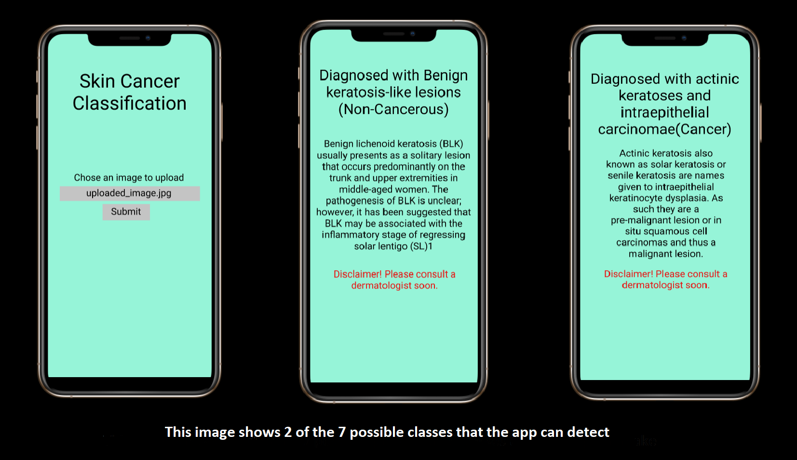
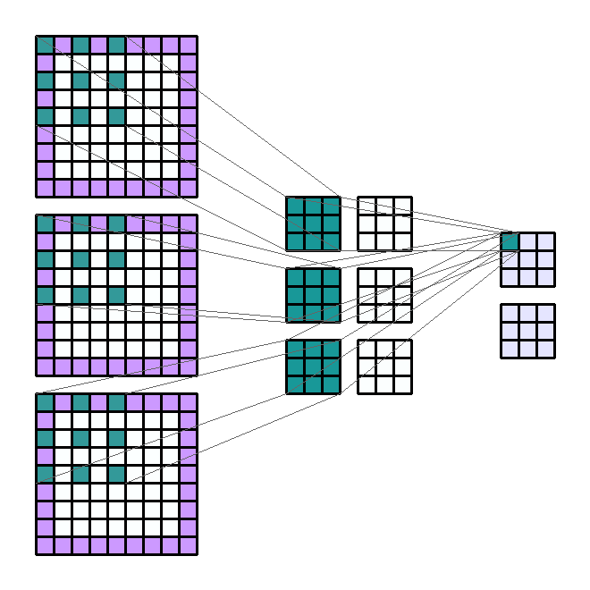
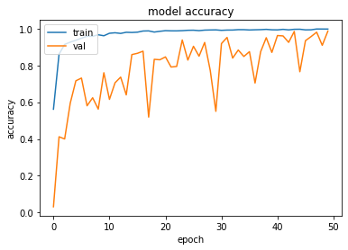
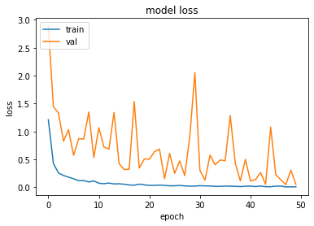
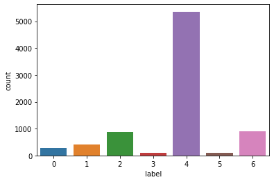
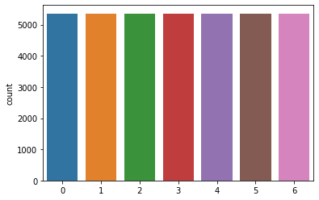

 _Switch to dark mode for better readability_ 

[_**CLICK HERE to download the project proposal**_](./ProjectProposalforSkinCancerClassification.pdf)

[_**CLICK HERE to download a zip folder containing test images of skin lesions**_](./SkinLesionTestImages.zip)

[_**Link to my Jupyter Notebook**_](https://github.com/rohanmandrekar/Skin-Cancer-Classification/blob/main/Skin_Cancer_Detection.ipynb)

[_**Link to YouTube video for the webapp**_](https://youtu.be/IWHKOQYbfP0)

[_**Link to my Kaggle submission**_](https://www.kaggle.com/rohanmandrekar/skin-cancer-classification-using-cnn-96-test-acc)

# Motivation(Why I chose this project):
According to [skincancer.org](https://www.skincancer.org/skin-cancer-information/skin-cancer-facts/) Skin cancer is the most common cancer in the United States and worldwide. 1 in 5 Americans will develop skin cancer by the age of 70. Early detection of skin cancer is vital to ensure successful treatment. An app that can self-diagnose any potential skin cancer within seconds with the ease of a button click can prove to be beneficial by greatly bringing down to cost and time for testing. Since the app also detects some diseases which appear like cancer, but are non-cancerous, it can alleviate the stress of people in such cases.

## What the app will look like:
 

## Features supported by the App:
User can click a picture of his/her infected skin region and upload it on the app. 
The app will classify the disease into one of the following: actinic keratoses and 
intraepithelial carcinoma, basal cell carcinoma, benign keratosis-like lesions, 
dermatofibroma, melanocytic nevi, pyogenic granulomas and haemorrhage, 
and melanoma.
After classifying the disease, the app can also show some information about 
the disease, and suggest the user to contact a dermatologist as soon as 
possible

## Explanation of a few algorithms:
### Conv2D:
2D convolution layer (e.g. spatial convolution over images).

This layer creates a convolution kernel that is convolved with the layer input to produce a tensor of outputs. If use_bias is True, a bias vector is created and added to the outputs. Finally, if activation is not None, it is applied to the outputs as well.

When using this layer as the first layer in a model, provide the keyword argument input_shape (tuple of integers, does not include the sample axis), e.g. input_shape=(128, 128, 3) for 128x128 RGB pictures in data_format="channels_last".

Below is a GIF showing the working of the Conv2D layer:



### MaxPool2D:
Max pooling operation for 2D spatial data.

Downsamples the input representation by taking the maximum value over the window defined by pool_size for each dimension along the features axis. The window is shifted by strides in each dimension. The resulting output when using "valid" padding option has a shape(number of rows or columns) of: output_shape = (input_shape - pool_size + 1) / strides)

The resulting output shape when using the "same" padding option is: output_shape = input_shape / strides

It returns a tensor of rank 4 representing the maximum pooled values. See above for output shape.

### BatchNormalization layer:
Layer that normalizes its inputs.

Batch normalization applies a transformation that maintains the mean output close to 0 and the output standard deviation close to 1.

Importantly, batch normalization works differently during training and during inference.

## My Contribution:
I designed my own classifier from scratch. below is the architecture for the CNN model:

    Model: "sequential"
    _________________________________________________________________
    Layer (type)                 Output Shape              Param #   
    =================================================================
    conv2d (Conv2D)              (None, 28, 28, 16)        448       
    _________________________________________________________________
    max_pooling2d (MaxPooling2D) (None, 14, 14, 16)        0         
    _________________________________________________________________
    batch_normalization (BatchNo (None, 14, 14, 16)        64        
    _________________________________________________________________
    conv2d_1 (Conv2D)            (None, 12, 12, 32)        4640      
    _________________________________________________________________
    conv2d_2 (Conv2D)            (None, 10, 10, 64)        18496     
    _________________________________________________________________
    max_pooling2d_1 (MaxPooling2 (None, 5, 5, 64)          0         
    _________________________________________________________________
    batch_normalization_1 (Batch (None, 5, 5, 64)          256       
    _________________________________________________________________
    conv2d_3 (Conv2D)            (None, 3, 3, 128)         73856     
    _________________________________________________________________
    conv2d_4 (Conv2D)            (None, 1, 1, 256)         295168    
    _________________________________________________________________
    flatten (Flatten)            (None, 256)               0         
    _________________________________________________________________
    dropout (Dropout)            (None, 256)               0         
    _________________________________________________________________
    dense (Dense)                (None, 256)               65792     
    _________________________________________________________________
    batch_normalization_2 (Batch (None, 256)               1024      
    _________________________________________________________________
    dropout_1 (Dropout)          (None, 256)               0         
    _________________________________________________________________
    dense_1 (Dense)              (None, 128)               32896     
    _________________________________________________________________
    batch_normalization_3 (Batch (None, 128)               512       
    _________________________________________________________________
    dense_2 (Dense)              (None, 64)                8256      
    _________________________________________________________________
    batch_normalization_4 (Batch (None, 64)                256       
    _________________________________________________________________
    dropout_2 (Dropout)          (None, 64)                0         
    _________________________________________________________________
    dense_3 (Dense)              (None, 32)                2080      
    _________________________________________________________________
    batch_normalization_5 (Batch (None, 32)                128       
    _________________________________________________________________
    dense_4 (Dense)              (None, 7)                 231       
    =================================================================
    Total params: 504,103
    Trainable params: 502,983
    Non-trainable params: 1,120
    _________________________________________________________________
    

Test Accuracy achieved: 96.01%

```python
x_test=np.array(x_test).reshape(-1,28,28,3)
loss, acc = model.evaluate(x_test, y_test, verbose=2)
```

    63/63 - 1s - loss: 0.1790 - accuracy: 0.9601

Train Accuracy achieved: 99.79%

Validation accuracy achieved: 98.61% 

    Epoch 50/50
    235/235 [==============================] - 2s 9ms/step - loss: 0.0068 - accuracy: 0.9979 - val_loss: 0.0518 - val_accuracy: 0.9861  

Graph showing training and validation accuracy trend:



Graph showing training and validation loss trend:



## Challenges Faced:

Initially after training my model I noticed that the validation accuracy was too low (mid 60s). I then tried adjusting the learning rate to fix it, but got no great change.
I then browsed other notebooks posted on Kaggle for this particular dataset. I came accross [Dhruv's](https://www.kaggle.com/dhruv1234/ham10000-skin-disease-classification) notebook which explained that the frequency of the classes were imbalanced (class melanocytic nevi had a far greater frequency than others). To fix this I had to use RandomOverSampler to make the frequency of the classes more balanced. Below are 2 graphs showing the frequncy of the classes before and after random over sampling.

Before random over sampling:


After random over sampling:


Doing this resulted in a significant jump in accuracy

## Experiments and findings:
After experimenting with many different architectures for the CNN model I realised that adding the BatchNormalization layer after each Dense, and MaxPooling2D layer can help increase the validation accuracy. Addition of Dropout layers can help prevent overfitting.  


### References:

[1] https://www.kaggle.com/dhruv1234/ham10000-skin-disease-classification

[2] https://github.com/rohanmandrekar/Cifar-10-/blob/master/best_attempt%28model7%29.ipynb

[3] https://www.kaggle.com/kmader/skin-cancer-mnist-ham10000

[4] https://keras.io/api/layers/normalization_layers/batch_normalization/

[5] https://keras.io/api/layers/convolution_layers/convolution2d/

[6] https://github.com/AxelThevenot/GIF_convolutions

[7] https://keras.io/api/layers/pooling_layers/max_pooling2d/

