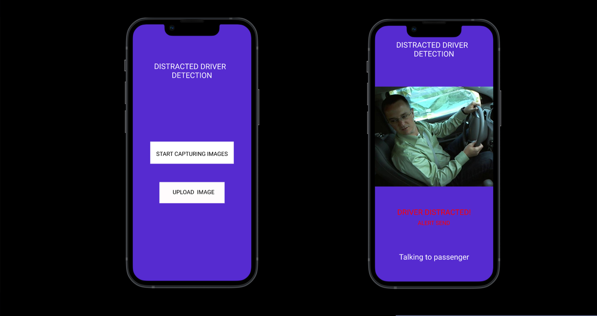
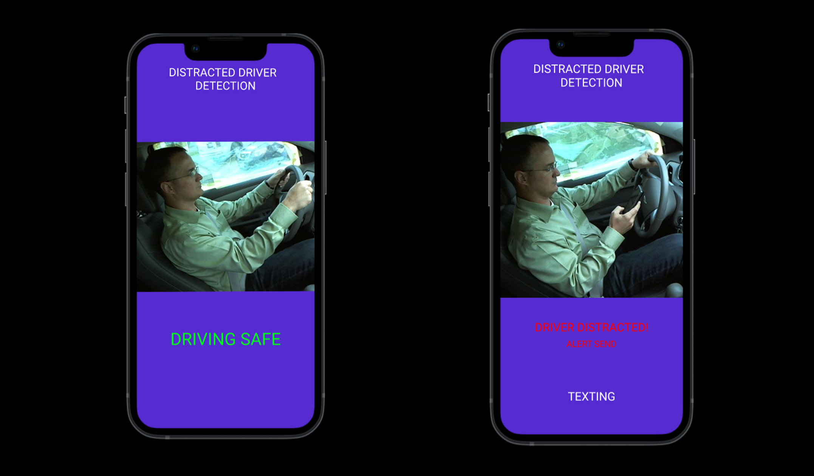
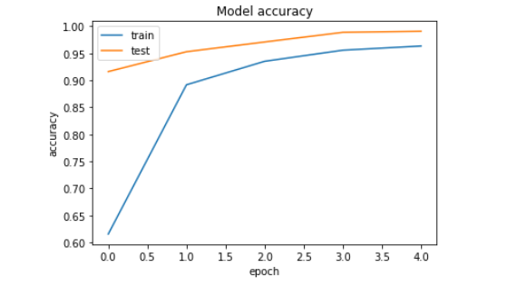
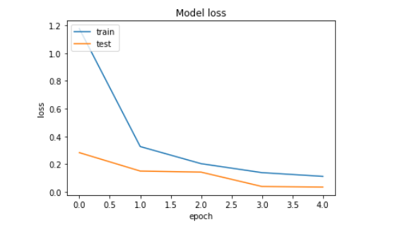

 _Switch to dark mode for better readability_ 

[_**CLICK HERE to download the project proposal**_](./PROJECT_PROPOSAL.pdf)

[_**CLICK HERE to download a zip folder containing test images of drivers**_](./testimages.zip)

[_**Link to my Jupyter Notebook**_](https://github.com/saahilanande/datamining_term_project/blob/main/term-project.ipynb)

[_**Link to my Kaggle submission**_](https://www.kaggle.com/saahilanande/term-project)

# Motivation(Why I chose this project):
Driving a car is a complex task, and it requires complete attention.[The National Highway Traffic Safety Administration (NHTSA)](https://www.nhtsa.gov/traffic-deaths-decreased-2018-still-36560-people-died) reported that 36,750 people died in motor vehicle crashes in 2018, and 12% of it was due to distracted driving. Fortunately, technology is adapting to help keep today’s drivers, I believe that computer vision can augment the efforts of the governments to prevent accidents caused by distracted driving. An app that can capture realtime images of the driver and alert them if they are distracted within seconds with the ease of a button click can prove to be beneficial by greatly bringing down mishaps.

## What the app will look like:

 

## Features supported by the App:
The app will allow user to upload a photo or capture real time photos of the driver, classifying it as distracted or not distracted within seconds with the ease of a button click

The app will classify the picture into one of the following normal driving, texting, talking on the phone, operating the radio, drinking ,reaching behind, hair and makeup , talking to passenger.

After classifying the image, the app will alert the driver or the passenger if he is distracted and pay attention on the road.

## Explanation of a few algorithms:
### Conv2D:
2D convolution layer (e.g. spatial convolution over images).

This layer creates a convolution kernel that is convolved with the layer input to produce a tensor of outputs. If use_bias is True, a bias vector is created and added to the outputs. Finally, if activation is not None, it is applied to the outputs as well.

When using this layer as the first layer in a model, provide the keyword argument input_shape (tuple of integers, does not include the sample axis), e.g. input_shape=(128, 128, 3) for 128x128 RGB pictures in data_format="channels_last".

Below is a GIF showing the working of the Conv2D layer:


### MaxPool2D:
Max pooling operation for 2D spatial data.

Downsamples the input representation by taking the maximum value over the window defined by pool_size for each dimension along the features axis. The window is shifted by strides in each dimension. The resulting output when using "valid" padding option has a shape(number of rows or columns) of: output_shape = (input_shape - pool_size + 1) / strides)

The resulting output shape when using the "same" padding option is: output_shape = input_shape / strides

It returns a tensor of rank 4 representing the maximum pooled values. See above for output shape.

### BatchNormalization layer:
Layer that normalizes its inputs.

Batch normalization applies a transformation that maintains the mean output close to 0 and the output standard deviation close to 1.

Importantly, batch normalization works differently during training and during inference.

## My Contribution:
I designed my own classifier from scratch. below is the architecture for the CNN model:

       Model: "sequential"
    _________________________________________________________________
    Layer (type)                 Output Shape              Param #   
    =================================================================
    conv2d (Conv2D)              (None, 62, 62, 64)        640       
    _________________________________________________________________
    batch_normalization (BatchNo (None, 62, 62, 64)        256       
    _________________________________________________________________
    max_pooling2d (MaxPooling2D) (None, 31, 31, 64)        0         
    _________________________________________________________________
    dropout (Dropout)            (None, 31, 31, 64)        0         
    _________________________________________________________________
    conv2d_1 (Conv2D)            (None, 31, 31, 128)       73856     
    _________________________________________________________________
    batch_normalization_1 (Batch (None, 31, 31, 128)       512       
    _________________________________________________________________
    max_pooling2d_1 (MaxPooling2 (None, 16, 16, 128)       0         
    _________________________________________________________________
    dropout_1 (Dropout)          (None, 16, 16, 128)       0         
    _________________________________________________________________
    conv2d_2 (Conv2D)            (None, 16, 16, 256)       295168    
    _________________________________________________________________
    batch_normalization_2 (Batch (None, 16, 16, 256)       1024      
    _________________________________________________________________
    max_pooling2d_2 (MaxPooling2 (None, 8, 8, 256)         0         
    _________________________________________________________________
    dropout_2 (Dropout)          (None, 8, 8, 256)         0         
    _________________________________________________________________
    flatten (Flatten)            (None, 16384)             0         
    _________________________________________________________________
    dense (Dense)                (None, 512)               8389120   
    _________________________________________________________________
    batch_normalization_3 (Batch (None, 512)               2048      
    _________________________________________________________________
    dropout_3 (Dropout)          (None, 512)               0         
    _________________________________________________________________
    dense_1 (Dense)              (None, 128)               65664     
    _________________________________________________________________
    dropout_4 (Dropout)          (None, 128)               0         
    _________________________________________________________________
    dense_2 (Dense)              (None, 10)                1290      
    =================================================================
    Total params: 8,829,578
    Trainable params: 8,827,658
    Non-trainable params: 1,920
        _________________________________________________________________
    

Test Accuracy achieved: 99.15%

```python
score = cnnmodel.evaluate(x_test, y_test, verbose=1)
```

    loss: 0.0308 - accuracy: 0.9915

Train Accuracy achieved: 99.79%

Validation accuracy achieved: 99.15% 

    Epoch 5/5
    359/359 [==============================] - 5s 15ms/step - loss: 0.1366 - accuracy: 0.9569 - val_loss: 0.0308 - val_accuracy: 0.9915

Graph showing training and validation accuracy trend:



Graph showing training and validation loss trend:



## Challenges Faced:

Initially after training my model I noticed that the validation accuracy was too low (mid 60s). I then tried adjusting the learning rate to fix it, but got no great change.
I then browsed other notebooks posted on Kaggle for this particular dataset. I came accross [Dhruv's](https://www.kaggle.com/dhruv1234/ham10000-skin-disease-classification) notebook which explained that the frequency of the classes were imbalanced (class melanocytic nevi had a far greater frequency than others). To fix this I had to use RandomOverSampler to make the frequency of the classes more balanced. Below are 2 graphs showing the frequncy of the classes before and after random over sampling.

Before random over sampling:


After random over sampling:


Doing this resulted in a significant jump in accuracy

## Experiments and findings:
After experimenting with many different architectures for the CNN model I realised that adding the BatchNormalization layer after each Dense, and MaxPooling2D layer can help increase the validation accuracy. Addition of Dropout layers can help prevent overfitting.  


### References:

[1] https://www.kaggle.com/ismailchaida/cnn-to-detect-driver-actions

[2] https://www.kaggle.com/pierrelouisdanieau/computer-vision-tips-to-increase-accuracy

[3] https://towardsdatascience.com/convolution-neural-network-for-image-processing-using-keras-dc3429056306

[4] https://keras.io/api/layers/normalization_layers/batch_normalization/

[5] https://keras.io/api/layers/convolution_layers/convolution2d/

[6] https://www.analyticsvidhya.com/blog/2021/06/building-a-convolutional-neural-network-using-tensorflow-keras/

[7] https://keras.io/api/layers/pooling_layers/max_pooling2d/

